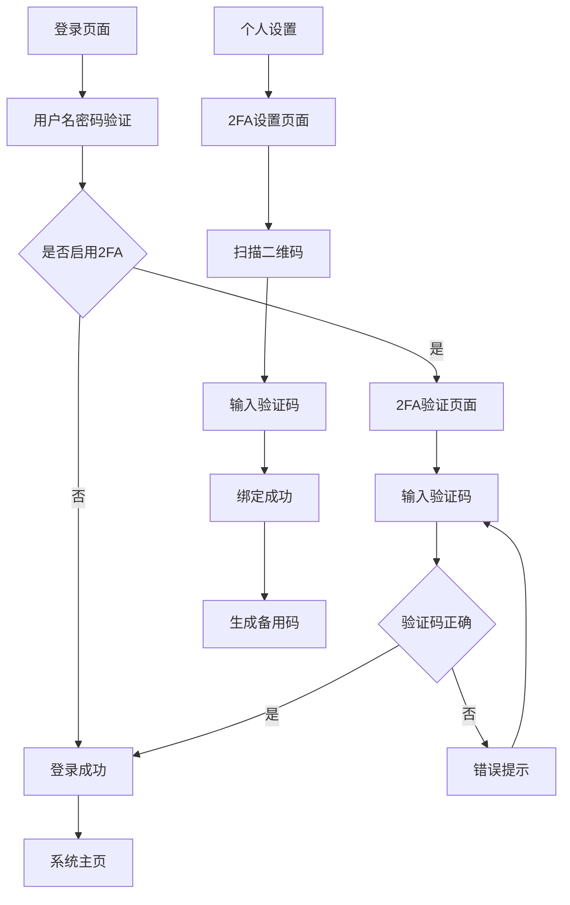

# HotGo项目二次因子验证(2FA)功能产品需求文档

## 1. 产品概述

本文档旨在为HotGo管理系统添加二次因子验证(Two-Factor Authentication, 2FA)功能，提升系统安全性。该功能将基于TOTP(Time-based One-Time Password)算法实现，兼容Google Authenticator、Microsoft Authenticator等主流身份验证应用。

* 解决问题：增强用户账户安全性，防止密码泄露导致的账户被盗用

* 目标用户：HotGo管理系统的所有管理员用户

* 产品价值：显著提升系统安全等级，满足企业级安全要求

## 2. 核心功能

### 2.1 用户角色

| 角色    | 权限说明   | 核心功能              |
| ----- | ------ | ----------------- |
| 超级管理员 | 系统配置权限 | 可配置2FA全局开关、强制启用策略 |
| 普通管理员 | 个人账户管理 | 可绑定/解绑2FA设备、管理备用码 |

### 2.2 功能模块

我们的2FA功能包含以下核心页面：

1. **2FA设置页面**：设备绑定、二维码生成、验证码验证
2. **2FA验证页面**：登录时的二次验证界面
3. **备用码管理页面**：备用恢复码生成和管理
4. **系统配置页面**：2FA全局开关和策略配置
5. **安全日志页面**：2FA相关的安全操作记录

### 2.3 页面详情

| 页面名称    | 模块名称   | 功能描述                      |
| ------- | ------ | ------------------------- |
| 2FA设置页面 | 设备绑定模块 | 生成TOTP密钥、显示二维码、验证绑定状态     |
| 2FA设置页面 | 验证测试模块 | 输入验证码测试、绑定确认、解绑操作         |
| 2FA设置页面 | 备用码模块  | 生成10个备用恢复码、下载保存、使用记录      |
| 2FA验证页面 | 验证输入模块 | 6位数字验证码输入、倒计时显示、错误提示      |
| 2FA验证页面 | 备用验证模块 | 备用码输入选项、使用说明、紧急联系         |
| 系统配置页面  | 全局开关模块 | 启用/禁用2FA、强制策略配置、宽限期设置     |
| 系统配置页面  | 安全策略模块 | 验证码有效期、最大尝试次数、锁定时间        |
| 安全日志页面  | 操作记录模块 | 2FA绑定/解绑记录、验证成功/失败日志、异常告警 |

## 3. 核心流程

### 3.1 管理员2FA绑定流程

1. 管理员登录系统后，进入个人设置页面
2. 点击"启用二次验证"，系统生成TOTP密钥
3. 显示二维码，用户使用身份验证应用扫描
4. 用户输入验证码确认绑定
5. 系统生成备用恢复码供用户保存
6. 绑定完成，下次登录需要2FA验证

### 3.2 管理员登录验证流程

1. 用户输入用户名和密码
2. 系统验证基础凭据
3. 如果用户已启用2FA，跳转到2FA验证页面
4. 用户输入6位验证码或备用码
5. 系统验证TOTP码的有效性
6. 验证成功后完成登录，生成会话令牌

### 3.3 系统管理员配置流程

1. 超级管理员进入系统配置页面
2. 配置2FA全局开关和安全策略
3. 设置强制启用策略和宽限期
4. 保存配置并通知相关用户

## 4. 用户界面设计

### 4.1 设计风格

* **主色调**：沿用HotGo现有的蓝色主题 (#1890ff)，辅助色为绿色 (#52c41a) 表示安全

* **按钮样式**：圆角按钮，与现有设计保持一致

* **字体**：14px 常规文本，16px 标题文本，使用系统默认字体栈

* **布局风格**：卡片式布局，顶部导航，与现有后台设计风格统一

* **图标风格**：使用Naive UI图标库，安全相关使用盾牌、锁等图标

### 4.2 页面设计概览

| 页面名称    | 模块名称   | UI元素                                  |
| ------- | ------ | ------------------------------------- |
| 2FA设置页面 | 设备绑定模块 | 二维码显示区域(200x200px)、密钥文本框、复制按钮、绑定状态指示器 |
| 2FA设置页面 | 验证测试模块 | 6位数字输入框、验证按钮(蓝色)、解绑按钮(红色)、帮助文本        |
| 2FA验证页面 | 验证输入模块 | 大号数字输入框、30秒倒计时圆环、错误提示(红色文本)           |
| 2FA验证页面 | 备用验证模块 | 折叠面板、备用码输入框、使用说明文本、联系管理员链接            |
| 系统配置页面  | 全局开关模块 | 开关组件、策略选择下拉框、宽限期数字输入、保存按钮             |
| 安全日志页面  | 操作记录模块 | 表格组件、时间筛选器、状态标签(成功/失败)、导出按钮           |

### 4.3 响应式设计

* **设计优先级**：桌面优先，移动端适配

* **断点设置**：768px以下为移动端，调整布局为单列显示

* **触摸优化**：按钮最小点击区域44px，输入框增大间距

* **二维码适配**：移动端二维码尺寸调整为150x150px，确保扫描便利性

