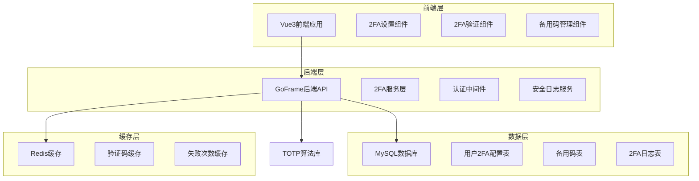
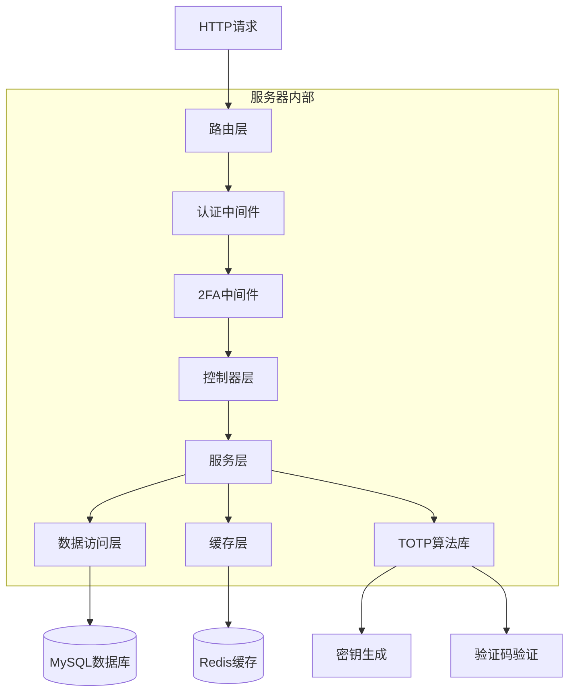
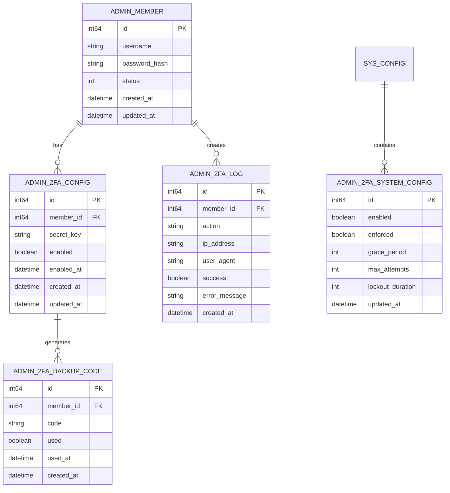

# HotGo项目2FA功能技术架构文档

## 1. 架构设计



## 2. 技术描述

* **前端**: Vue3 + Naive UI + TypeScript + Vite

* **后端**: GoFrame v2 + MySQL 8.0 + Redis 6.0

* **2FA算法**: TOTP (RFC 6238) + Base32编码

* **安全库**: crypto/hmac + crypto/sha1 + encoding/base32

## 3. 路由定义

| 路由                      | 用途                   |
| ----------------------- | -------------------- |
| /account/security       | 个人安全设置页面，包含2FA配置选项   |
| /account/2fa-setup      | 2FA设备绑定页面，显示二维码和验证流程 |
| /login/2fa-verify       | 登录时的2FA验证页面          |
| /account/backup-codes   | 备用恢复码管理页面            |
| /system/security-config | 系统安全配置页面（超级管理员）      |
| /log/security-log       | 安全操作日志页面             |

## 4. API定义

### 4.1 核心API

#### 2FA设备绑定相关

```
POST /api/admin/2fa/generate-secret
```

生成2FA密钥和二维码

请求:

| 参数名 | 参数类型 | 是否必需 | 描述   |
| --- | ---- | ---- | ---- |
| 无   | -    | -    | 无需参数 |

响应:

| 参数名       | 参数类型   | 描述          |
| --------- | ------ | ----------- |
| secret    | string | Base32编码的密钥 |
| qrCode    | string | 二维码Base64数据 |
| backupUrl | string | 手动输入URL     |

示例:

```json
{
  "secret": "JBSWY3DPEHPK3PXP",
  "qrCode": "data:image/png;base64,iVBORw0KGgoAAAANSUhEUgAA...",
  "backupUrl": "otpauth://totp/HotGo:admin?secret=JBSWY3DPEHPK3PXP&issuer=HotGo"
}
```

```
POST /api/admin/2fa/verify-and-enable
```

验证并启用2FA

请求:

| 参数名    | 参数类型   | 是否必需 | 描述    |
| ------ | ------ | ---- | ----- |
| secret | string | true | 临时密钥  |
| code   | string | true | 6位验证码 |

响应:

| 参数名         | 参数类型      | 描述       |
| ----------- | --------- | -------- |
| success     | boolean   | 启用是否成功   |
| backupCodes | \[]string | 10个备用恢复码 |

```
POST /api/admin/2fa/disable
```

禁用2FA

请求:

| 参数名      | 参数类型   | 是否必需 | 描述       |
| -------- | ------ | ---- | -------- |
| password | string | true | 当前密码确认   |
| code     | string | true | 当前2FA验证码 |

#### 2FA验证相关

```
POST /api/admin/2fa/verify
```

登录时2FA验证

请求:

| 参数名   | 参数类型   | 是否必需 | 描述        |
| ----- | ------ | ---- | --------- |
| token | string | true | 登录临时令牌    |
| code  | string | true | 6位验证码或备用码 |

响应:

| 参数名               | 参数类型    | 描述     |
| ----------------- | ------- | ------ |
| success           | boolean | 验证是否成功 |
| accessToken       | string  | 访问令牌   |
| remainingAttempts | int     | 剩余尝试次数 |

#### 备用码管理

```
POST /api/admin/2fa/regenerate-backup-codes
```

重新生成备用码

请求:

| 参数名      | 参数类型   | 是否必需 | 描述     |
| -------- | ------ | ---- | ------ |
| password | string | true | 当前密码确认 |

响应:

| 参数名         | 参数类型      | 描述      |
| ----------- | --------- | ------- |
| backupCodes | \[]string | 新的备用恢复码 |

#### 系统配置相关

```
POST /api/admin/system/2fa-config
```

更新2FA系统配置

请求:

| 参数名             | 参数类型    | 是否必需 | 描述       |
| --------------- | ------- | ---- | -------- |
| enabled         | boolean | true | 是否启用2FA  |
| enforced        | boolean | true | 是否强制启用   |
| gracePeriod     | int     | true | 宽限期（天）   |
| maxAttempts     | int     | true | 最大尝试次数   |
| lockoutDuration | int     | true | 锁定时长（分钟） |

## 5. 服务器架构图



## 6. 数据模型

### 6.1 数据模型定义



### 6.2 数据定义语言

#### 用户2FA配置表 (hg\_admin\_2fa\_config)

```sql
-- 创建2FA配置表
CREATE TABLE `hg_admin_2fa_config` (
    `id` bigint(20) unsigned NOT NULL AUTO_INCREMENT COMMENT '配置ID',
    `member_id` bigint(20) unsigned NOT NULL COMMENT '管理员ID',
    `secret_key` varchar(32) NOT NULL COMMENT 'TOTP密钥',
    `enabled` tinyint(1) NOT NULL DEFAULT '0' COMMENT '是否启用',
    `enabled_at` datetime DEFAULT NULL COMMENT '启用时间',
    `created_at` datetime NOT NULL DEFAULT CURRENT_TIMESTAMP COMMENT '创建时间',
    `updated_at` datetime NOT NULL DEFAULT CURRENT_TIMESTAMP ON UPDATE CURRENT_TIMESTAMP COMMENT '更新时间',
    PRIMARY KEY (`id`),
    UNIQUE KEY `uk_member_id` (`member_id`),
    KEY `idx_enabled` (`enabled`)
) ENGINE=InnoDB DEFAULT CHARSET=utf8mb4 COMMENT='管理员2FA配置表';

-- 创建索引
CREATE INDEX idx_admin_2fa_config_member_id ON hg_admin_2fa_config(member_id);
CREATE INDEX idx_admin_2fa_config_enabled ON hg_admin_2fa_config(enabled);
```

#### 备用恢复码表 (hg\_admin\_2fa\_backup\_code)

```sql
-- 创建备用码表
CREATE TABLE `hg_admin_2fa_backup_code` (
    `id` bigint(20) unsigned NOT NULL AUTO_INCREMENT COMMENT '备用码ID',
    `member_id` bigint(20) unsigned NOT NULL COMMENT '管理员ID',
    `code` varchar(16) NOT NULL COMMENT '备用恢复码',
    `used` tinyint(1) NOT NULL DEFAULT '0' COMMENT '是否已使用',
    `used_at` datetime DEFAULT NULL COMMENT '使用时间',
    `created_at` datetime NOT NULL DEFAULT CURRENT_TIMESTAMP COMMENT '创建时间',
    PRIMARY KEY (`id`),
    UNIQUE KEY `uk_code` (`code`),
    KEY `idx_member_id` (`member_id`),
    KEY `idx_used` (`used`)
) ENGINE=InnoDB DEFAULT CHARSET=utf8mb4 COMMENT='2FA备用恢复码表';

-- 创建索引
CREATE INDEX idx_admin_2fa_backup_code_member_id ON hg_admin_2fa_backup_code(member_id);
CREATE INDEX idx_admin_2fa_backup_code_used ON hg_admin_2fa_backup_code(used);
```

#### 2FA操作日志表 (hg\_admin\_2fa\_log)

```sql
-- 创建2FA日志表
CREATE TABLE `hg_admin_2fa_log` (
    `id` bigint(20) unsigned NOT NULL AUTO_INCREMENT COMMENT '日志ID',
    `member_id` bigint(20) unsigned NOT NULL COMMENT '管理员ID',
    `action` varchar(50) NOT NULL COMMENT '操作类型',
    `ip_address` varchar(45) NOT NULL COMMENT 'IP地址',
    `user_agent` text COMMENT '用户代理',
    `success` tinyint(1) NOT NULL COMMENT '是否成功',
    `error_message` varchar(255) DEFAULT NULL COMMENT '错误信息',
    `created_at` datetime NOT NULL DEFAULT CURRENT_TIMESTAMP COMMENT '创建时间',
    PRIMARY KEY (`id`),
    KEY `idx_member_id` (`member_id`),
    KEY `idx_action` (`action`),
    KEY `idx_success` (`success`),
    KEY `idx_created_at` (`created_at`)
) ENGINE=InnoDB DEFAULT CHARSET=utf8mb4 COMMENT='2FA操作日志表';

-- 创建索引
CREATE INDEX idx_admin_2fa_log_member_id ON hg_admin_2fa_log(member_id);
CREATE INDEX idx_admin_2fa_log_created_at ON hg_admin_2fa_log(created_at DESC);
CREATE INDEX idx_admin_2fa_log_action ON hg_admin_2fa_log(action);
```

#### 系统配置扩展

```sql
-- 在sys_config表中插入2FA相关配置
INSERT INTO `hg_sys_config` (`group`, `key`, `value`, `type`, `title`, `tip`, `rule`, `extend`, `remark`, `sort`, `status`, `created_at`, `updated_at`) VALUES
('security', '2faEnabled', '0', 'switch', '启用二次验证', '是否启用系统二次验证功能', '', '', '控制整个系统的2FA功能开关', 100, 1, NOW(), NOW()),
('security', '2faEnforced', '0', 'switch', '强制二次验证', '是否强制所有用户启用2FA', '', '', '强制策略，启用后所有用户必须配置2FA', 101, 1, NOW(), NOW()),
('security', '2faGracePeriod', '7', 'input', '2FA宽限期', '强制启用2FA后的宽限期（天）', 'integer|min:1|max:30', '', '用户必须在宽限期内完成2FA配置', 102, 1, NOW(), NOW()),
('security', '2faMaxAttempts', '5', 'input', '最大尝试次数', '2FA验证最大失败次数', 'integer|min:3|max:10', '', '超过次数将锁定账户', 103, 1, NOW(), NOW()),
('security', '2faLockoutDuration', '30', 'input', '锁定时长', '验证失败锁定时长（分钟）', 'integer|min:5|max:1440', '', '账户锁定的持续时间', 104, 1, NOW(), NOW());
```

