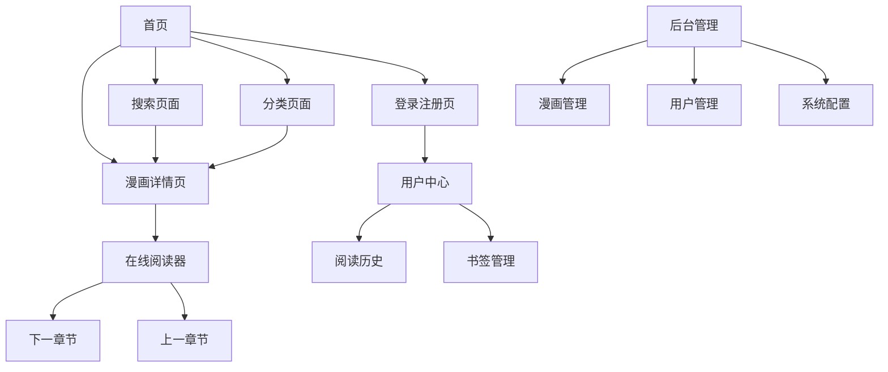

# AniX漫画平台产品需求文档

## 1. 产品概述

AniX是一个现代化的在线漫画阅读平台，致力于为用户提供优质的漫画阅读体验。平台采用Vue3 + Go + MySQL + Redis技术栈构建，支持多端访问，具备完整的用户管理、内容管理和阅读功能。

平台主要解决用户在线漫画阅读需求，为漫画爱好者提供便捷的阅读工具，为内容创作者提供发布平台，为企业用户提供可定制的漫画平台解决方案。目标是成为领先的在线漫画阅读平台，服务全球漫画爱好者。

## 2. 核心功能

### 2.1 用户角色

| 角色 | 注册方式 | 核心权限 |
|------|----------|----------|
| 访客用户 | 无需注册 | 可浏览漫画、搜索、阅读免费内容，每日限制10章 |
| 注册用户 | 邮箱注册 | 可保存阅读进度、添加书签、评论评分，每日限制50章 |
| 开发者 | 申请升级 | 可调用API接口、访问技术文档、使用SDK |
| 后台管理员 | 系统分配 | 可管理用户、内容审核、系统配置、数据统计 |

### 2.2 功能模块

我们的漫画平台需求包含以下主要页面：

1. **首页**：热门推荐、最新更新、分类导航、搜索入口
2. **漫画详情页**：漫画信息展示、章节列表、评分评论、相关推荐
3. **在线阅读器**：图片展示、翻页控制、阅读设置、进度保存
4. **搜索页面**：关键词搜索、高级筛选、搜索结果展示
5. **分类页面**：按分类浏览、排序筛选、分页展示
6. **用户中心**：个人信息、阅读历史、书签管理、设置配置
7. **登录注册页**：用户认证、密码找回、邮箱验证
8. **后台管理**：内容管理、用户管理、系统配置、数据统计

### 2.3 页面详情

| 页面名称 | 模块名称 | 功能描述 |
|----------|----------|----------|
| 首页 | 导航栏 | 显示网站Logo、主导航菜单、用户登录状态、搜索框 |
| 首页 | 轮播推荐 | 展示热门漫画的轮播图，支持自动切换和手动切换 |
| 首页 | 分类导航 | 显示漫画分类标签，支持快速筛选和跳转 |
| 首页 | 热门漫画 | 展示热门漫画列表，包含封面、标题、评分、简介 |
| 首页 | 最新更新 | 显示最近更新的漫画，按更新时间排序 |
| 漫画详情页 | 漫画信息 | 展示漫画封面、标题、作者、简介、标签、评分等基本信息 |
| 漫画详情页 | 章节列表 | 显示所有章节，支持正序倒序排列，标记免费/付费章节 |
| 漫画详情页 | 评论系统 | 用户评论展示、评分功能、点赞回复 |
| 漫画详情页 | 相关推荐 | 推荐相似漫画，基于分类和标签匹配 |
| 在线阅读器 | 图片展示 | 显示漫画页面图片，支持缩放、适应屏幕 |
| 在线阅读器 | 翻页控制 | 支持鼠标点击、键盘方向键、滑动手势翻页 |
| 在线阅读器 | 阅读设置 | 阅读模式切换（竖读/横读/双页）、亮度调节、夜间模式 |
| 在线阅读器 | 进度保存 | 自动保存阅读进度，支持跨设备同步 |
| 在线阅读器 | 工具栏 | 章节导航、设置面板、全屏模式、分享功能 |
| 搜索页面 | 搜索框 | 关键词输入、搜索建议、历史搜索记录 |
| 搜索页面 | 高级筛选 | 按分类、状态、评分、更新时间等条件筛选 |
| 搜索页面 | 结果展示 | 搜索结果列表，支持列表和网格视图切换 |
| 分类页面 | 分类导航 | 显示所有分类，支持多选和排除筛选 |
| 分类页面 | 排序选项 | 按热度、评分、更新时间、章节数排序 |
| 分类页面 | 漫画列表 | 分页展示漫画，支持无限滚动加载 |
| 用户中心 | 个人信息 | 头像上传、昵称修改、密码修改、邮箱绑定 |
| 用户中心 | 阅读历史 | 显示最近阅读的漫画，支持继续阅读和删除记录 |
| 用户中心 | 书签管理 | 收藏的漫画列表，支持分类管理和批量操作 |
| 用户中心 | 设置配置 | 阅读偏好设置、通知设置、隐私设置 |
| 登录注册页 | 登录表单 | 用户名/邮箱登录、密码输入、记住登录状态 |
| 登录注册页 | 注册表单 | 用户名、邮箱、密码注册，邮箱验证 |
| 登录注册页 | 密码找回 | 通过邮箱重置密码功能 |
| 后台管理 | 漫画管理 | 漫画上传、编辑、删除、批量操作、状态管理 |
| 后台管理 | 章节管理 | 章节上传、排序、图片管理、发布控制 |
| 后台管理 | 用户管理 | 用户列表、权限分配、状态控制、行为统计 |
| 后台管理 | 系统配置 | 网站设置、安全配置、缓存管理、备份恢复 |
| 后台管理 | 数据统计 | 用户统计、阅读统计、收入统计、趋势分析 |

## 3. 核心流程

### 访客用户流程
访客用户可以直接访问首页浏览热门漫画和最新更新，通过搜索或分类找到感兴趣的漫画，点击进入详情页查看漫画信息和章节列表，选择章节开始阅读。在阅读过程中可以使用基本的翻页和设置功能，但无法保存进度和添加书签。

### 注册用户流程
注册用户首先需要通过邮箱注册账号并验证，登录后可以享受完整的阅读体验。用户可以保存阅读进度，添加书签收藏喜欢的漫画，在个人中心管理阅读历史和收藏。用户还可以对漫画进行评分和评论，参与社区互动。

### 开发者流程
开发者需要先注册普通用户账号，然后申请升级为开发者权限。获得权限后可以在开发者中心创建应用，获取API密钥，调用平台提供的各种API接口。开发者可以使用SDK快速集成功能，访问完整的技术文档和示例代码。

### 管理员流程
管理员通过后台管理系统登录，可以管理平台的所有内容和用户。管理员可以上传和编辑漫画，管理章节内容，审核用户评论，处理用户举报。同时可以查看各种数据统计，配置系统参数，管理用户权限。

## 4. 用户界面设计

### 4.1 设计风格

**主色调和辅助色：**
- 主色调：#2563EB（现代蓝色）- 用于主要按钮、链接和重要元素
- 辅助色：#64748B（中性灰）- 用于次要文本和边框
- 成功色：#10B981（翠绿色）- 用于成功状态和确认操作
- 警告色：#F59E0B（橙黄色）- 用于警告提示
- 错误色：#EF4444（红色）- 用于错误状态和删除操作

**按钮样式：**
- 采用圆角矩形设计（border-radius: 6px）
- 主要按钮使用渐变效果和阴影
- 悬停状态有颜色变化和轻微缩放动画
- 支持不同尺寸：大型、中型、小型

**字体和字号：**
- 主字体：'Inter', 'Helvetica Neue', Arial, sans-serif
- 标题字体：'Poppins', sans-serif
- 主要文本：16px，行高1.6
- 标题文本：24px-32px，行高1.4
- 辅助文本：14px，行高1.5

**布局风格：**
- 采用卡片式设计，增强内容层次感
- 顶部导航栏固定，提供快速访问
- 响应式网格布局，适配不同屏幕尺寸
- 使用阴影和间距营造空间感

**图标和表情：**
- 使用Heroicons图标库，风格简洁现代
- 支持表情符号增强用户体验
- 图标颜色与主题色调保持一致

### 4.2 页面设计概览

| 页面名称 | 模块名称 | UI元素 |
|----------|----------|--------|
| 首页 | 导航栏 | 深色背景(#1F2937)，白色Logo和文字，搜索框使用圆角设计，用户头像圆形显示 |
| 首页 | 轮播推荐 | 大尺寸图片轮播，渐变遮罩层，白色标题文字，圆点指示器，自动播放3秒间隔 |
| 首页 | 分类导航 | 水平滚动的标签列表，选中状态使用主色调背景，未选中使用灰色边框 |
| 首页 | 漫画卡片 | 白色背景卡片，圆角阴影，封面图片比例16:9，标题粗体显示，评分使用星级图标 |
| 漫画详情页 | 漫画信息 | 左侧大封面图，右侧信息区域，标签使用彩色胶囊样式，评分显示数字和星级 |
| 漫画详情页 | 章节列表 | 列表样式，奇偶行不同背景色，免费章节绿色标记，VIP章节金色标记 |
| 在线阅读器 | 阅读界面 | 黑色背景，图片居中显示，工具栏半透明浮动，设置面板从右侧滑出 |
| 在线阅读器 | 控制按钮 | 圆形按钮，白色图标，半透明背景，悬停时完全不透明 |
| 搜索页面 | 搜索框 | 大尺寸输入框，搜索图标，实时搜索建议下拉列表，历史记录标签样式 |
| 搜索页面 | 筛选面板 | 左侧固定面板，分类复选框，滑块选择器，重置和应用按钮 |
| 用户中心 | 侧边导航 | 垂直导航菜单，选中项高亮显示，图标+文字组合，响应式折叠 |
| 用户中心 | 内容区域 | 白色背景，表单样式统一，头像上传支持拖拽，历史记录卡片布局 |
| 后台管理 | 管理界面 | 深色侧边栏，浅色内容区，数据表格斑马纹，操作按钮颜色区分，统计图表现代风格 |

### 4.3 响应式设计

**桌面优先设计**：主要针对桌面端用户优化，提供完整的功能体验。

**移动端适配**：
- 导航栏在移动端折叠为汉堡菜单
- 漫画卡片在小屏幕上单列显示
- 阅读器支持触摸手势操作
- 表单元素增大触摸区域
- 文字大小适当调整保证可读性

**触摸交互优化**：
- 按钮最小触摸区域44px
- 支持滑动翻页手势
- 长按显示上下文菜单
- 双击缩放图片
- 捏合手势调整图片大小

**断点设置**：
- 移动端：< 768px
- 平板端：768px - 1024px  
- 桌面端：> 1024px
- 大屏幕：> 1440px

---

*最后更新时间：2025年8月19日*  
*文档版本：v1.0.0*  
*适用系统版本：AniX v1.0.0*