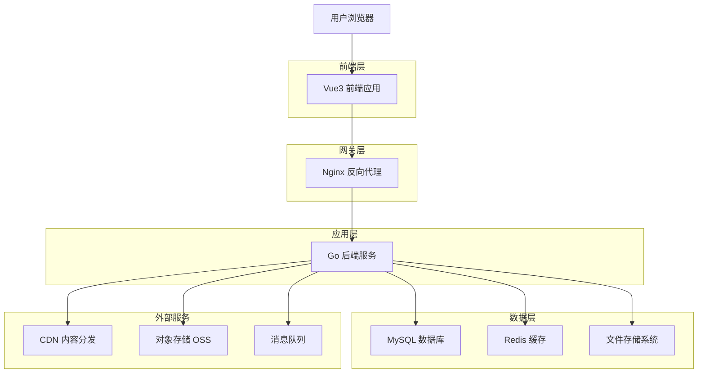
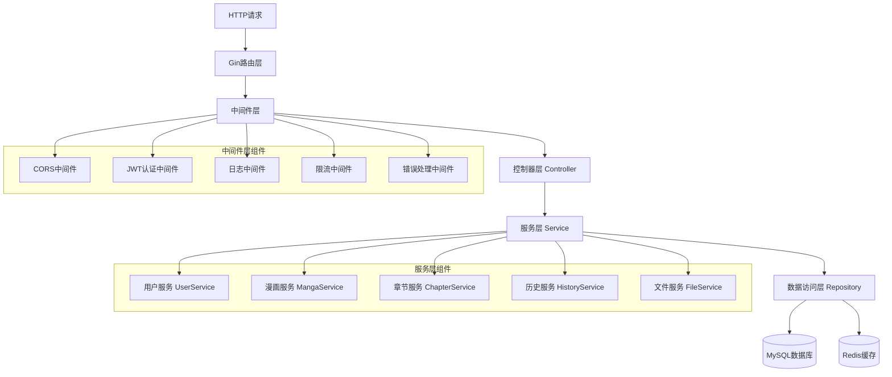
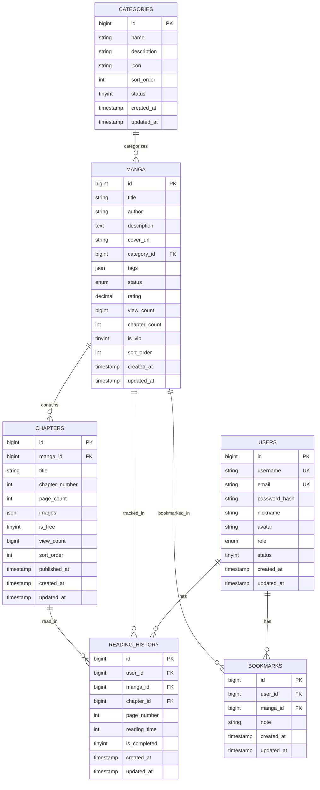

# AniX漫画平台技术架构文档

## 1. 架构设计



## 2. 技术描述

### 2.1 核心技术栈

- **前端**: Vue3 + TypeScript + Vite + Element Plus + Pinia
- **后端**: Go + Gin + GORM + JWT + Swagger
- **数据库**: MySQL 8.0 + Redis 6.0
- **部署**: Docker + Docker Compose + Nginx
- **存储**: 本地文件系统 + 阿里云OSS（可选）
- **缓存**: Redis + 内存缓存
- **监控**: Prometheus + Grafana

### 2.2 依赖版本

**前端依赖：**
```json
{
  "vue": "^3.3.0",
  "typescript": "^5.0.0",
  "vite": "^4.4.0",
  "element-plus": "^2.3.0",
  "pinia": "^2.1.0",
  "vue-router": "^4.2.0",
  "axios": "^1.4.0",
  "@vueuse/core": "^10.0.0"
}
```

**后端依赖：**
```go
module hotgo

go 1.21

require (
    github.com/gin-gonic/gin v1.9.1
    github.com/golang-jwt/jwt/v5 v5.0.0
    github.com/redis/go-redis/v9 v9.0.5
    gorm.io/driver/mysql v1.5.1
    gorm.io/gorm v1.25.2
    github.com/swaggo/gin-swagger v1.6.0
    github.com/go-playground/validator/v10 v10.14.0
)
```

## 3. 路由定义

### 3.1 前端路由

| 路由 | 组件 | 说明 |
|------|------|------|
| `/` | Home | 首页，展示热门漫画和推荐内容 |
| `/manga/:id` | MangaDetail | 漫画详情页，显示漫画信息和章节列表 |
| `/read/:mangaId/:chapterId` | Reader | 在线阅读器，提供漫画阅读功能 |
| `/search` | Search | 搜索页面，支持关键词和高级搜索 |
| `/category/:id` | Category | 分类页面，按分类浏览漫画 |
| `/user/profile` | Profile | 用户个人中心 |
| `/user/history` | History | 阅读历史记录 |
| `/user/bookmarks` | Bookmarks | 用户书签收藏 |
| `/login` | Login | 用户登录页面 |
| `/register` | Register | 用户注册页面 |
| `/admin` | AdminLayout | 后台管理入口（需要管理员权限） |

### 3.2 后端路由组

```go
// 公开路由（无需认证）
public := r.Group("/anix")
{
    public.POST("/auth/login", authController.Login)
    public.POST("/auth/register", authController.Register)
    public.GET("/manga/list", mangaController.GetList)
    public.GET("/manga/detail/:id", mangaController.GetDetail)
    public.GET("/manga/search", mangaController.Search)
    public.GET("/category/list", categoryController.GetList)
}

// 需要认证的路由
auth := r.Group("/anix")
auth.Use(middleware.JWTAuth())
{
    auth.GET("/user/profile", userController.GetProfile)
    auth.PUT("/user/profile", userController.UpdateProfile)
    auth.GET("/history/list", historyController.GetList)
    auth.POST("/history/save", historyController.SaveProgress)
    auth.GET("/bookmarks/list", bookmarkController.GetList)
    auth.POST("/bookmarks/add", bookmarkController.Add)
}

// 管理员路由
admin := r.Group("/anix/admin")
admin.Use(middleware.JWTAuth(), middleware.AdminAuth())
{
    admin.GET("/manga/list", adminMangaController.GetList)
    admin.POST("/manga/create", adminMangaController.Create)
    admin.PUT("/manga/update/:id", adminMangaController.Update)
    admin.DELETE("/manga/delete/:id", adminMangaController.Delete)
    admin.GET("/users/list", adminUserController.GetList)
    admin.PUT("/users/status/:id", adminUserController.UpdateStatus)
}
```

## 4. API定义

### 4.1 认证相关API

#### 用户登录
```
POST /anix/auth/login
```

**请求参数：**
| 参数名 | 类型 | 必填 | 说明 |
|--------|------|------|------|
| username | string | 是 | 用户名或邮箱 |
| password | string | 是 | 密码 |

**响应数据：**
| 参数名 | 类型 | 说明 |
|--------|------|------|
| code | int | 状态码，0表示成功 |
| message | string | 响应消息 |
| data.token | string | JWT认证令牌 |
| data.expires_in | int | 令牌过期时间（秒） |
| data.user_info | object | 用户基本信息 |

**请求示例：**
```json
{
  "username": "testuser",
  "password": "password123"
}
```

**响应示例：**
```json
{
  "code": 0,
  "message": "登录成功",
  "data": {
    "token": "eyJhbGciOiJIUzI1NiIsInR5cCI6IkpXVCJ9...",
    "expires_in": 3600,
    "user_info": {
      "id": 1,
      "username": "testuser",
      "nickname": "测试用户",
      "role": "user"
    }
  }
}
```

### 4.2 漫画相关API

#### 获取漫画列表
```
GET /anix/manga/list
```

**请求参数：**
| 参数名 | 类型 | 必填 | 说明 |
|--------|------|------|------|
| page | int | 否 | 页码，默认1 |
| limit | int | 否 | 每页数量，默认20 |
| category | string | 否 | 分类筛选 |
| status | string | 否 | 连载状态筛选 |
| sort | string | 否 | 排序方式：latest, popular, rating |

**响应数据：**
| 参数名 | 类型 | 说明 |
|--------|------|------|
| code | int | 状态码 |
| message | string | 响应消息 |
| data.list | array | 漫画列表 |
| data.total | int | 总数量 |
| data.page | int | 当前页码 |
| data.limit | int | 每页数量 |

#### 获取漫画详情
```
GET /anix/manga/detail/:id
```

**路径参数：**
| 参数名 | 类型 | 必填 | 说明 |
|--------|------|------|------|
| id | int | 是 | 漫画ID |

**响应示例：**
```json
{
  "code": 0,
  "message": "获取成功",
  "data": {
    "id": 1,
    "title": "进击的巨人",
    "author": "谏山创",
    "description": "在这个世界上，人类居住在由三重巨大的城墙所围成的都市里...",
    "cover_url": "/uploads/covers/attack_on_titan.jpg",
    "category": "动作",
    "tags": ["热血", "战斗", "悬疑"],
    "status": "completed",
    "rating": 9.2,
    "view_count": 1500000,
    "chapter_count": 139,
    "chapters": [
      {
        "id": 1,
        "title": "第1话 致两千年后的你",
        "chapter_number": 1,
        "page_count": 45,
        "is_free": true,
        "published_at": "2023-01-01T00:00:00Z"
      }
    ]
  }
}
```

### 4.3 章节内容API

#### 获取章节内容
```
GET /anix/chapter/content/:id
```

**响应示例：**
```json
{
  "code": 0,
  "message": "获取成功",
  "data": {
    "id": 1,
    "title": "第1话 致两千年后的你",
    "chapter_number": 1,
    "page_count": 45,
    "images": [
      "/uploads/chapters/1/page_001.jpg",
      "/uploads/chapters/1/page_002.jpg",
      "/uploads/chapters/1/page_003.jpg"
    ],
    "prev_chapter": null,
    "next_chapter": {
      "id": 2,
      "title": "第2话 那一天"
    }
  }
}
```

### 4.4 用户相关API

#### 保存阅读进度
```
POST /anix/history/save
```

**请求参数：**
| 参数名 | 类型 | 必填 | 说明 |
|--------|------|------|------|
| manga_id | int | 是 | 漫画ID |
| chapter_id | int | 是 | 章节ID |
| page_number | int | 是 | 当前页码 |
| reading_time | int | 否 | 阅读时长（秒） |

**请求示例：**
```json
{
  "manga_id": 1,
  "chapter_id": 5,
  "page_number": 10,
  "reading_time": 300
}
```

## 5. 服务器架构图



## 6. 数据模型

### 6.1 数据模型定义



### 6.2 数据定义语言

#### 用户表 (hg_anix_users)
```sql
-- 创建用户表
CREATE TABLE `hg_anix_users` (
  `id` bigint(20) unsigned NOT NULL AUTO_INCREMENT COMMENT '用户ID',
  `username` varchar(50) NOT NULL COMMENT '用户名',
  `email` varchar(100) NOT NULL COMMENT '邮箱',
  `password_hash` varchar(255) NOT NULL COMMENT '密码哈希',
  `nickname` varchar(50) DEFAULT NULL COMMENT '昵称',
  `avatar` varchar(255) DEFAULT NULL COMMENT '头像URL',
  `role` enum('guest','user','developer','admin') DEFAULT 'user' COMMENT '用户角色',
  `status` tinyint(1) DEFAULT 1 COMMENT '状态：1正常，0禁用',
  `created_at` timestamp DEFAULT CURRENT_TIMESTAMP COMMENT '创建时间',
  `updated_at` timestamp DEFAULT CURRENT_TIMESTAMP ON UPDATE CURRENT_TIMESTAMP COMMENT '更新时间',
  PRIMARY KEY (`id`),
  UNIQUE KEY `uk_username` (`username`),
  UNIQUE KEY `uk_email` (`email`),
  KEY `idx_role` (`role`),
  KEY `idx_status` (`status`)
) ENGINE=InnoDB DEFAULT CHARSET=utf8mb4 COMMENT='用户表';

-- 创建索引
CREATE INDEX idx_users_created_at ON hg_anix_users(created_at DESC);
CREATE INDEX idx_users_role_status ON hg_anix_users(role, status);

-- 初始化管理员用户
INSERT INTO hg_anix_users (username, email, password_hash, nickname, role, status) VALUES
('admin', 'admin@anix.com', '$2a$10$92IXUNpkjO0rOQ5byMi.Ye4oKoEa3Ro9llC/.og/at2.uheWG/igi', '系统管理员', 'admin', 1),
('developer', 'dev@anix.com', '$2a$10$92IXUNpkjO0rOQ5byMi.Ye4oKoEa3Ro9llC/.og/at2.uheWG/igi', '开发者', 'developer', 1);
```

#### 分类表 (hg_anix_categories)
```sql
-- 创建分类表
CREATE TABLE `hg_anix_categories` (
  `id` bigint(20) unsigned NOT NULL AUTO_INCREMENT COMMENT '分类ID',
  `name` varchar(50) NOT NULL COMMENT '分类名称',
  `description` varchar(200) DEFAULT NULL COMMENT '分类描述',
  `icon` varchar(100) DEFAULT NULL COMMENT '分类图标',
  `sort_order` int(11) DEFAULT 0 COMMENT '排序权重',
  `status` tinyint(1) DEFAULT 1 COMMENT '状态：1启用，0禁用',
  `created_at` timestamp DEFAULT CURRENT_TIMESTAMP COMMENT '创建时间',
  `updated_at` timestamp DEFAULT CURRENT_TIMESTAMP ON UPDATE CURRENT_TIMESTAMP COMMENT '更新时间',
  PRIMARY KEY (`id`),
  UNIQUE KEY `uk_name` (`name`),
  KEY `idx_status` (`status`),
  KEY `idx_sort_order` (`sort_order`)
) ENGINE=InnoDB DEFAULT CHARSET=utf8mb4 COMMENT='漫画分类表';

-- 初始化分类数据
INSERT INTO hg_anix_categories (name, description, icon, sort_order) VALUES
('动作', '充满战斗和冒险的漫画', 'action', 1),
('恋爱', '浪漫爱情题材的漫画', 'romance', 2),
('喜剧', '轻松搞笑的漫画', 'comedy', 3),
('悬疑', '推理和悬疑题材', 'mystery', 4),
('科幻', '科学幻想题材', 'sci-fi', 5),
('奇幻', '魔法和奇幻世界', 'fantasy', 6),
('校园', '学校生活题材', 'school', 7),
('历史', '历史背景的漫画', 'history', 8);
```

#### 漫画表 (hg_anix_manga)
```sql
-- 创建漫画表
CREATE TABLE `hg_anix_manga` (
  `id` bigint(20) unsigned NOT NULL AUTO_INCREMENT COMMENT '漫画ID',
  `title` varchar(200) NOT NULL COMMENT '漫画标题',
  `author` varchar(100) DEFAULT NULL COMMENT '作者',
  `description` text COMMENT '简介',
  `cover_url` varchar(255) DEFAULT NULL COMMENT '封面图片URL',
  `category_id` bigint(20) unsigned DEFAULT NULL COMMENT '分类ID',
  `tags` json DEFAULT NULL COMMENT '标签列表',
  `status` enum('ongoing','completed','paused') DEFAULT 'ongoing' COMMENT '连载状态',
  `rating` decimal(3,2) DEFAULT 0.00 COMMENT '评分',
  `view_count` bigint(20) DEFAULT 0 COMMENT '浏览次数',
  `chapter_count` int(11) DEFAULT 0 COMMENT '章节数量',
  `is_vip` tinyint(1) DEFAULT 0 COMMENT '是否VIP内容',
  `sort_order` int(11) DEFAULT 0 COMMENT '排序权重',
  `created_at` timestamp DEFAULT CURRENT_TIMESTAMP COMMENT '创建时间',
  `updated_at` timestamp DEFAULT CURRENT_TIMESTAMP ON UPDATE CURRENT_TIMESTAMP COMMENT '更新时间',
  PRIMARY KEY (`id`),
  KEY `idx_category` (`category_id`),
  KEY `idx_status` (`status`),
  KEY `idx_rating` (`rating`),
  KEY `idx_view_count` (`view_count`),
  KEY `idx_created_at` (`created_at`),
  KEY `idx_sort_order` (`sort_order`),
  FULLTEXT KEY `ft_title_author` (`title`,`author`),
  CONSTRAINT `fk_manga_category` FOREIGN KEY (`category_id`) REFERENCES `hg_anix_categories` (`id`) ON DELETE SET NULL
) ENGINE=InnoDB DEFAULT CHARSET=utf8mb4 COMMENT='漫画表';

-- 创建复合索引
CREATE INDEX idx_manga_status_rating ON hg_anix_manga(status, rating DESC);
CREATE INDEX idx_manga_category_status ON hg_anix_manga(category_id, status);
```

#### 章节表 (hg_anix_chapters)
```sql
-- 创建章节表
CREATE TABLE `hg_anix_chapters` (
  `id` bigint(20) unsigned NOT NULL AUTO_INCREMENT COMMENT '章节ID',
  `manga_id` bigint(20) unsigned NOT NULL COMMENT '漫画ID',
  `title` varchar(200) NOT NULL COMMENT '章节标题',
  `chapter_number` int(11) NOT NULL COMMENT '章节序号',
  `page_count` int(11) DEFAULT 0 COMMENT '页数',
  `images` json DEFAULT NULL COMMENT '图片URL列表',
  `is_free` tinyint(1) DEFAULT 1 COMMENT '是否免费',
  `view_count` bigint(20) DEFAULT 0 COMMENT '浏览次数',
  `sort_order` int(11) DEFAULT 0 COMMENT '排序权重',
  `published_at` timestamp NULL DEFAULT NULL COMMENT '发布时间',
  `created_at` timestamp DEFAULT CURRENT_TIMESTAMP COMMENT '创建时间',
  `updated_at` timestamp DEFAULT CURRENT_TIMESTAMP ON UPDATE CURRENT_TIMESTAMP COMMENT '更新时间',
  PRIMARY KEY (`id`),
  KEY `idx_manga_id` (`manga_id`),
  KEY `idx_chapter_number` (`chapter_number`),
  KEY `idx_published_at` (`published_at`),
  KEY `idx_view_count` (`view_count`),
  UNIQUE KEY `uk_manga_chapter` (`manga_id`,`chapter_number`),
  CONSTRAINT `fk_chapter_manga` FOREIGN KEY (`manga_id`) REFERENCES `hg_anix_manga` (`id`) ON DELETE CASCADE
) ENGINE=InnoDB DEFAULT CHARSET=utf8mb4 COMMENT='章节表';

-- 创建复合索引
CREATE INDEX idx_chapters_manga_published ON hg_anix_chapters(manga_id, published_at DESC);
CREATE INDEX idx_chapters_free_published ON hg_anix_chapters(is_free, published_at DESC);
```

#### 阅读历史表 (hg_anix_reading_history)
```sql
-- 创建阅读历史表
CREATE TABLE `hg_anix_reading_history` (
  `id` bigint(20) unsigned NOT NULL AUTO_INCREMENT COMMENT '记录ID',
  `user_id` bigint(20) unsigned NOT NULL COMMENT '用户ID',
  `manga_id` bigint(20) unsigned NOT NULL COMMENT '漫画ID',
  `chapter_id` bigint(20) unsigned NOT NULL COMMENT '章节ID',
  `page_number` int(11) DEFAULT 1 COMMENT '阅读页码',
  `reading_time` int(11) DEFAULT 0 COMMENT '阅读时长(秒)',
  `is_completed` tinyint(1) DEFAULT 0 COMMENT '是否读完',
  `created_at` timestamp DEFAULT CURRENT_TIMESTAMP COMMENT '创建时间',
  `updated_at` timestamp DEFAULT CURRENT_TIMESTAMP ON UPDATE CURRENT_TIMESTAMP COMMENT '更新时间',
  PRIMARY KEY (`id`),
  KEY `idx_user_id` (`user_id`),
  KEY `idx_manga_id` (`manga_id`),
  KEY `idx_chapter_id` (`chapter_id`),
  KEY `idx_updated_at` (`updated_at`),
  UNIQUE KEY `uk_user_chapter` (`user_id`,`chapter_id`),
  CONSTRAINT `fk_history_user` FOREIGN KEY (`user_id`) REFERENCES `hg_anix_users` (`id`) ON DELETE CASCADE,
  CONSTRAINT `fk_history_manga` FOREIGN KEY (`manga_id`) REFERENCES `hg_anix_manga` (`id`) ON DELETE CASCADE,
  CONSTRAINT `fk_history_chapter` FOREIGN KEY (`chapter_id`) REFERENCES `hg_anix_chapters` (`id`) ON DELETE CASCADE
) ENGINE=InnoDB DEFAULT CHARSET=utf8mb4 COMMENT='阅读历史表';

-- 创建复合索引
CREATE INDEX idx_history_user_updated ON hg_anix_reading_history(user_id, updated_at DESC);
CREATE INDEX idx_history_manga_user ON hg_anix_reading_history(manga_id, user_id);
```

#### 书签表 (hg_anix_bookmarks)
```sql
-- 创建书签表
CREATE TABLE `hg_anix_bookmarks` (
  `id` bigint(20) unsigned NOT NULL AUTO_INCREMENT COMMENT '书签ID',
  `user_id` bigint(20) unsigned NOT NULL COMMENT '用户ID',
  `manga_id` bigint(20) unsigned NOT NULL COMMENT '漫画ID',
  `note` varchar(500) DEFAULT NULL COMMENT '备注',
  `created_at` timestamp DEFAULT CURRENT_TIMESTAMP COMMENT '创建时间',
  `updated_at` timestamp DEFAULT CURRENT_TIMESTAMP ON UPDATE CURRENT_TIMESTAMP COMMENT '更新时间',
  PRIMARY KEY (`id`),
  KEY `idx_user_id` (`user_id`),
  KEY `idx_manga_id` (`manga_id`),
  KEY `idx_created_at` (`created_at`),
  UNIQUE KEY `uk_user_manga` (`user_id`,`manga_id`),
  CONSTRAINT `fk_bookmark_user` FOREIGN KEY (`user_id`) REFERENCES `hg_anix_users` (`id`) ON DELETE CASCADE,
  CONSTRAINT `fk_bookmark_manga` FOREIGN KEY (`manga_id`) REFERENCES `hg_anix_manga` (`id`) ON DELETE CASCADE
) ENGINE=InnoDB DEFAULT CHARSET=utf8mb4 COMMENT='用户书签表';

-- 创建复合索引
CREATE INDEX idx_bookmarks_user_created ON hg_anix_bookmarks(user_id, created_at DESC);
```

## 7. 性能优化策略

### 7.1 数据库优化

**索引优化：**
- 为常用查询字段创建合适的索引
- 使用复合索引优化多字段查询
- 定期分析和优化慢查询

**查询优化：**
- 使用分页查询避免大量数据加载
- 实现查询结果缓存
- 优化JOIN查询，避免N+1问题

### 7.2 缓存策略

**Redis缓存：**
```go
// 漫画详情缓存
key := fmt.Sprintf("manga:detail:%d", mangaID)
ttl := 30 * time.Minute

// 热门漫画列表缓存
key := "manga:hot:list"
ttl := 10 * time.Minute

// 用户阅读历史缓存
key := fmt.Sprintf("user:history:%d", userID)
ttl := 5 * time.Minute
```

**内存缓存：**
- 分类列表缓存
- 系统配置缓存
- 热门标签缓存

### 7.3 文件存储优化

**图片优化：**
- 自动压缩和格式转换
- 多尺寸图片生成
- WebP格式支持
- CDN加速分发

**存储策略：**
- 本地存储 + 云存储备份
- 分布式文件存储
- 图片懒加载
- 预加载策略

## 8. 安全措施

### 8.1 认证和授权

**JWT Token：**
```go
// Token生成
token := jwt.NewWithClaims(jwt.SigningMethodHS256, jwt.MapClaims{
    "user_id": user.ID,
    "username": user.Username,
    "role": user.Role,
    "exp": time.Now().Add(time.Hour * 24).Unix(),
})

tokenString, err := token.SignedString([]byte(secretKey))
```

**权限控制：**
- 基于角色的访问控制（RBAC）
- API接口权限验证
- 资源级别权限控制

### 8.2 数据安全

**密码安全：**
```go
// 密码加密
hashedPassword, err := bcrypt.GenerateFromPassword([]byte(password), bcrypt.DefaultCost)

// 密码验证
err := bcrypt.CompareHashAndPassword([]byte(hashedPassword), []byte(password))
```

**数据验证：**
- 输入参数验证
- SQL注入防护
- XSS攻击防护
- CSRF防护

### 8.3 API安全

**限流控制：**
```go
// 基于IP的限流
limiter := rate.NewLimiter(rate.Limit(100), 200) // 每秒100次，突发200次

// 基于用户的限流
userLimiter := rate.NewLimiter(rate.Limit(1000), 2000) // 每秒1000次
```

**请求验证：**
- API签名验证
- 时间戳验证
- 重放攻击防护

## 9. 监控和日志

### 9.1 应用监控

**性能指标：**
- API响应时间
- 数据库查询性能
- 内存和CPU使用率
- 并发连接数

**业务指标：**
- 用户活跃度
- 漫画阅读量
- 系统错误率
- 转化率统计

### 9.2 日志管理

**日志分类：**
```go
// 访问日志
logger.Info("API访问", 
    zap.String("method", c.Request.Method),
    zap.String("path", c.Request.URL.Path),
    zap.Int("status", c.Writer.Status()),
    zap.Duration("latency", latency),
)

// 错误日志
logger.Error("数据库错误",
    zap.Error(err),
    zap.String("sql", sql),
    zap.Any("params", params),
)

// 业务日志
logger.Info("用户登录",
    zap.Int64("user_id", userID),
    zap.String("ip", clientIP),
    zap.String("user_agent", userAgent),
)
```

**日志存储：**
- 本地文件存储
- ELK日志分析
- 日志轮转和清理
- 敏感信息脱敏

---

*最后更新时间：2025年8月19日*  
*文档版本：v1.0.0*  
*适用系统版本：AniX v1.0.0*