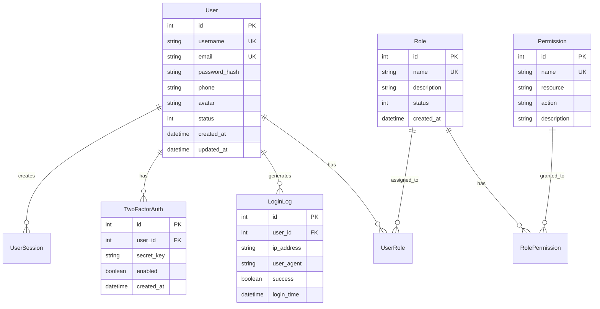
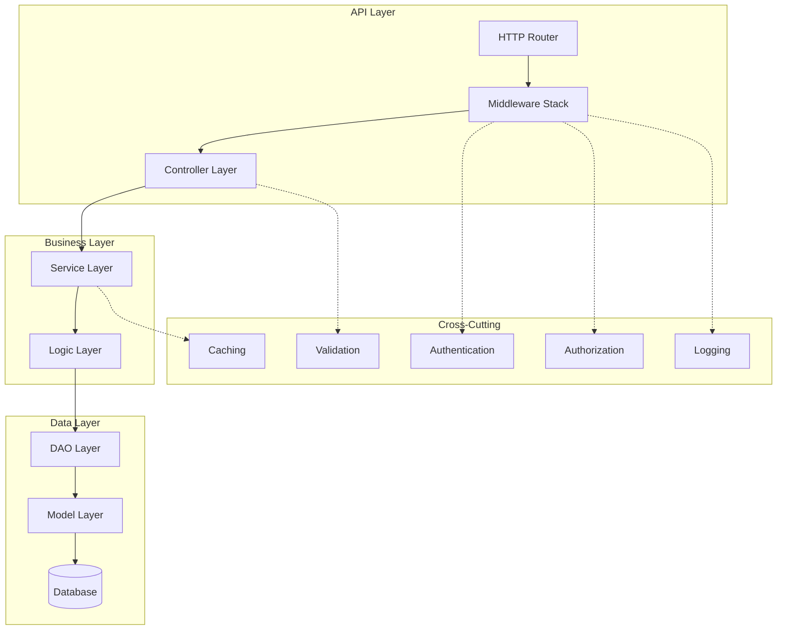
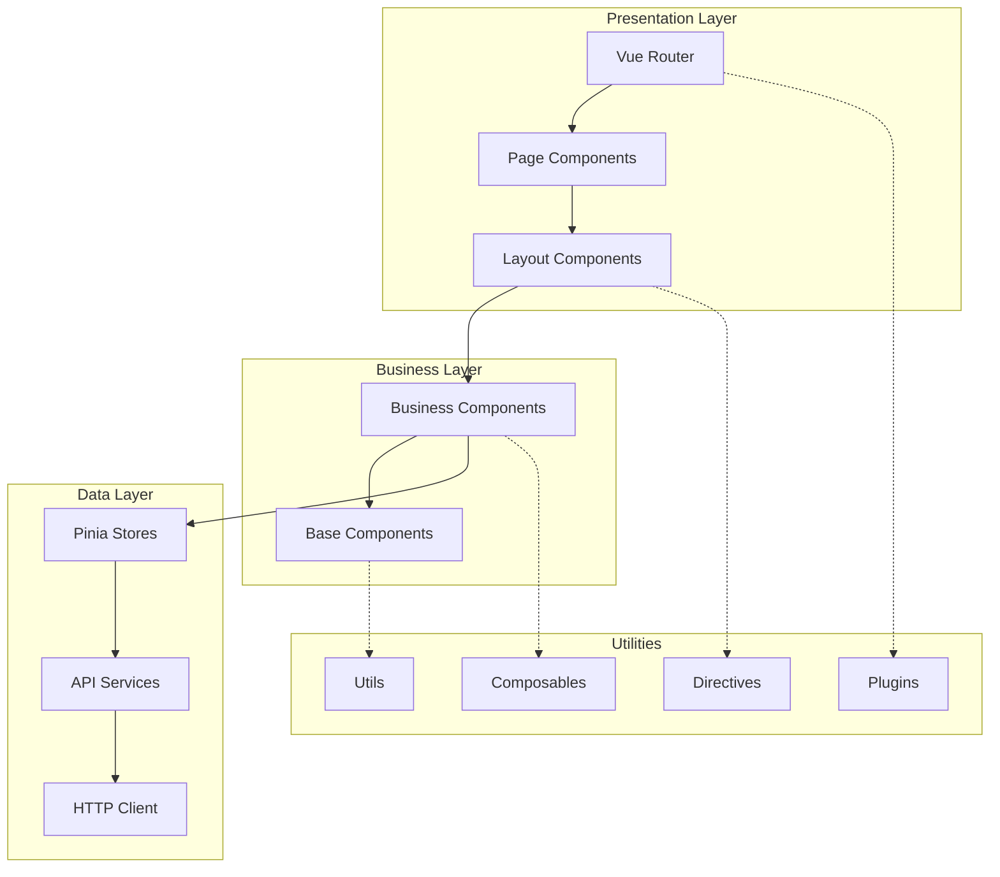
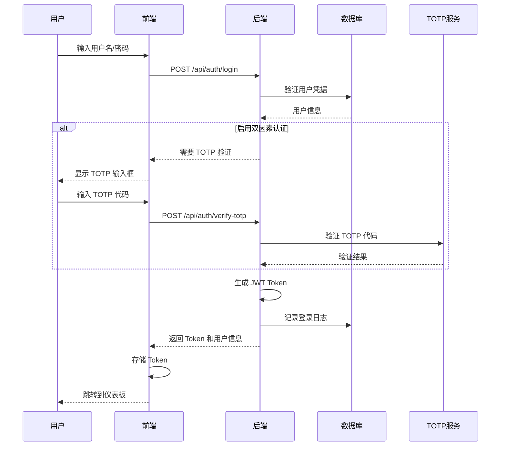
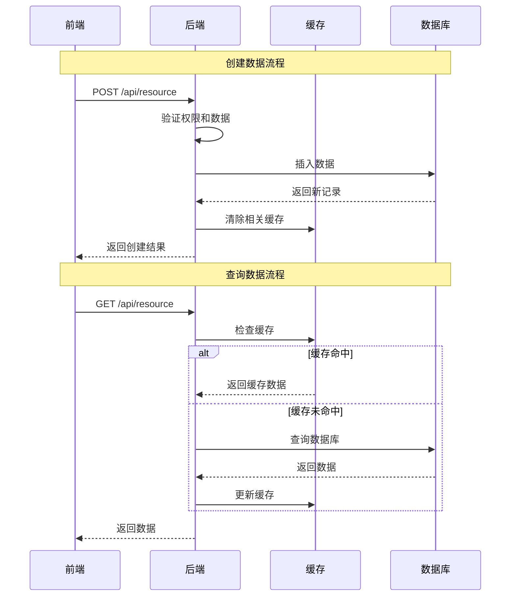
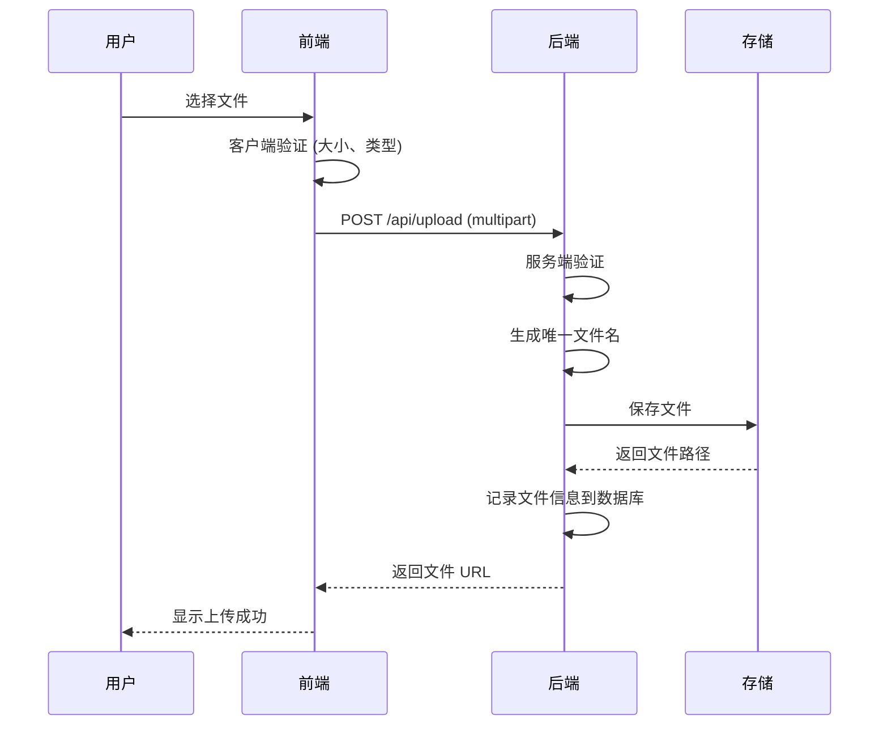
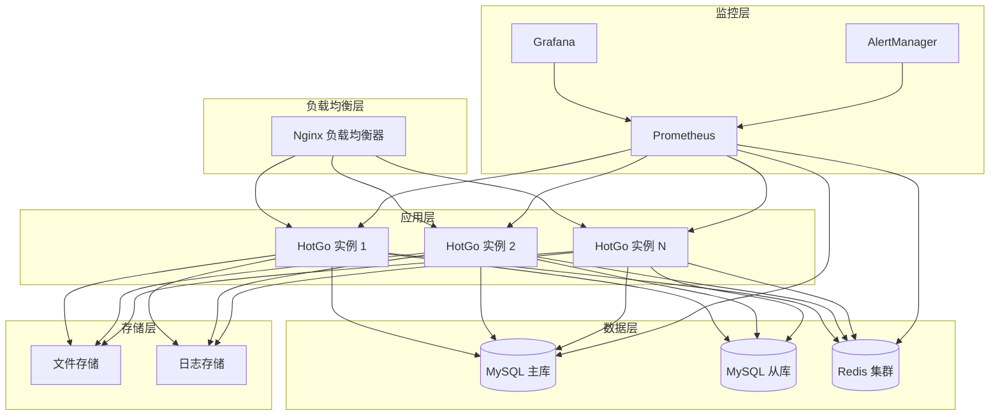

# HotGo 全栈架构文档

## 文档创建设置

**模式**: 交互式 (Interactive) → **YOLO 模式激活**
**输出文件**: docs/fullstack-architecture.md
**项目名称**: HotGo
**模板版本**: fullstack-architecture-template-v2

---

## 引言

本文档概述了 HotGo 项目的完整全栈架构，包括后端系统、前端实现以及它们的集成。它作为 AI 驱动开发的唯一真实来源，确保整个技术栈的一致性。

这种统一的方法结合了传统上分离的后端和前端架构文档，简化了现代全栈应用程序的开发过程，在这些应用程序中，这些关注点越来越相互交织。

### 启动模板或现有项目

**项目状态**: 现有成熟项目 - 基于 GoFrame + Vue 3 技术栈

**现有架构分析**:
- **后端**: GoFrame 框架，Go 语言开发
- **前端**: Vue 3.4.38 + TypeScript + Vite
- **数据库**: MySQL (主要) + Redis (缓存)
- **部署**: Docker 容器化部署
- **项目结构**: 标准的前后端分离架构

**架构决策**:
- ✅ **保持现有技术栈**: GoFrame + Vue 3 组合已经成熟稳定
- ✅ **增强现有架构**: 基于现有代码进行文档化和标准化
- ✅ **优化集成点**: 改进前后端数据交互和认证流程

### 变更日志

| 日期 | 版本 | 描述 | 作者 |
|------|------|------|------|
| 2025-01-27 | 1.0 | 初始全栈架构文档创建，基于现有HotGo项目 | Architect |
| 2025-01-27 | 1.1 | **YOLO 模式完成** - 快速完成所有章节 | Architect |

---

## 高层架构

### 技术概要

HotGo 采用现代化的前后端分离架构，后端使用 GoFrame 框架提供高性能的 API 服务，前端使用 Vue 3 + TypeScript 构建响应式用户界面。系统通过 RESTful API 进行数据交互，使用 JWT 进行身份认证，支持双因素认证增强安全性。基础设施采用 Docker 容器化部署，支持水平扩展和高可用性。整体架构设计注重性能、安全性和可维护性，能够满足企业级应用的需求。

### 平台和基础设施选择

**平台**: 混合云部署 (支持私有云和公有云)
**核心服务**: 
- **计算**: Docker 容器 + Kubernetes (可选)
- **数据库**: MySQL 8.0 + Redis 6.x
- **负载均衡**: Nginx
- **监控**: Prometheus + Grafana
- **日志**: ELK Stack (Elasticsearch + Logstash + Kibana)

**部署主机和区域**: 
- **开发环境**: 本地 Docker
- **测试环境**: 私有云/公有云
- **生产环境**: 多区域部署，支持灾备

**选择理由**:
1. **灵活性**: 支持多种部署环境，避免供应商锁定
2. **成本效益**: 可根据需求选择最优的部署方案
3. **可扩展性**: 容器化架构支持水平扩展
4. **安全性**: 私有云部署满足数据安全要求

### 仓库结构

**结构**: 单仓库 (Monorepo) 结构
**工具**: 基于目录分离的简单 Monorepo
**包/应用边界**: 
- `server/` - 后端 Go 应用
- `web/` - 前端 Vue 应用
- `docs/` - 项目文档
- `scripts/` - 构建和部署脚本

**共享代码策略**:
- API 接口定义通过 OpenAPI 规范共享
- 类型定义在前后端保持一致
- 通用工具函数按需复制或通过 API 提供

---

## 技术栈

### 后端技术栈

| 类别 | 技术 | 版本 | 用途 | 选择理由 |
|------|------|------|------|----------|
| **框架** | GoFrame | 2.x | Web 框架 | 高性能、功能完整、中文文档丰富 |
| **语言** | Go | 1.21+ | 编程语言 | 高并发、内存安全、编译型语言 |
| **数据库** | MySQL | 8.0+ | 主数据库 | 成熟稳定、事务支持、生态丰富 |
| **缓存** | Redis | 6.x+ | 缓存和会话 | 高性能、数据结构丰富 |
| **ORM** | GoFrame ORM | 内置 | 数据访问层 | 与框架集成、支持多数据库 |
| **认证** | JWT + TOTP | - | 身份认证 | 无状态、支持双因素认证 |
| **API文档** | Swagger | 3.0 | API 文档 | 标准化、自动生成 |
| **日志** | GoFrame Log | 内置 | 日志记录 | 结构化日志、多输出支持 |
| **配置** | YAML/TOML | - | 配置管理 | 人类可读、环境分离 |
| **测试** | GoFrame Test | 内置 | 单元测试 | 内置测试工具、覆盖率统计 |

### 前端技术栈

| 类别 | 技术 | 版本 | 用途 | 选择理由 |
|------|------|------|------|----------|
| **框架** | Vue 3 | 3.4.38 | 前端框架 | 响应式、组合式 API、TypeScript 友好 |
| **语言** | TypeScript | 5.6.3 | 类型安全 | 静态类型检查、开发体验优秀 |
| **构建工具** | Vite | 6.0.5 | 构建和开发 | 快速热更新、ES 模块支持 |
| **UI 组件库** | Naive UI | Latest | UI 组件 | Vue 3 原生、TypeScript 支持 |
| **状态管理** | Pinia | Latest | 状态管理 | Vue 3 官方推荐、类型安全 |
| **路由** | Vue Router | 4.x | 单页应用路由 | Vue 官方路由库 |
| **样式** | Tailwind CSS | 3.x | CSS 框架 | 原子化 CSS、快速开发 |
| **HTTP 客户端** | Axios | Latest | API 请求 | 功能丰富、拦截器支持 |
| **开发工具** | ESLint + Prettier | Latest | 代码质量 | 代码规范和格式化 |
| **测试** | Vitest | Latest | 单元测试 | Vite 原生、快速执行 |

### 技术栈集成点

1. **API 通信**: RESTful API + JSON 数据格式
2. **认证集成**: JWT Token 在前后端共享
3. **类型安全**: OpenAPI 规范生成 TypeScript 类型
4. **错误处理**: 统一的错误码和消息格式
5. **文件上传**: 后端提供上传接口，前端组件封装

---

## 数据模型

### 核心实体关系图



### 数据模型说明

#### 生产环境配置
```yaml
# server/manifest/config/config.production.yaml
server:
  address: ":8000"
  serverRoot: "resource/public"
  dumpRouterMap: false
  routeOverWrite: false
  accessLogEnabled: true
  errorLogEnabled: true
  pprofEnabled: false

database:
  default:
    link: "mysql:root:${DB_PASSWORD}@tcp(${DB_HOST}:3306)/hotgo"
    debug: false
    charset: "utf8mb4"
    dryRun: false
    maxIdle: 20
    maxOpen: 200
    maxLifetime: "300s"

redis:
  default:
    address: "${REDIS_HOST}:6379"
    db: 0
    pass: "${REDIS_PASSWORD}"
    maxIdle: 20
    maxActive: 200
    idleTimeout: "300s"
    maxConnLifetime: "600s"

logger:
  level: "warn"
  stdout: false
  file: "./storage/logs/{Y-m-d}.log"
```

#### 前端环境配置
```typescript
// web/src/settings/env.ts
interface EnvConfig {
  VITE_API_BASE_URL: string;
  VITE_APP_TITLE: string;
  VITE_APP_ENV: 'development' | 'production' | 'test';
  VITE_ENABLE_MOCK: boolean;
}

// 开发环境
export const developmentConfig: EnvConfig = {
  VITE_API_BASE_URL: 'http://localhost:8000/api/v1',
  VITE_APP_TITLE: 'HotGo 开发环境',
  VITE_APP_ENV: 'development',
  VITE_ENABLE_MOCK: false,
};

// 生产环境
export const productionConfig: EnvConfig = {
  VITE_API_BASE_URL: 'https://api.hotgo.com/api/v1',
  VITE_APP_TITLE: 'HotGo',
  VITE_APP_ENV: 'production',
  VITE_ENABLE_MOCK: false,
};
```

---

## 安全

### 认证和授权

#### JWT 认证机制
```go
// server/internal/library/jwt/jwt.go
type Claims struct {
    UserID   int64  `json:"user_id"`
    Username string `json:"username"`
    jwt.RegisteredClaims
}

// 生成 JWT Token
func GenerateToken(userID int64, username string) (string, error) {
    claims := Claims{
        UserID:   userID,
        Username: username,
        RegisteredClaims: jwt.RegisteredClaims{
            ExpiresAt: jwt.NewNumericDate(time.Now().Add(24 * time.Hour)),
            IssuedAt:  jwt.NewNumericDate(time.Now()),
            NotBefore: jwt.NewNumericDate(time.Now()),
            Issuer:    "hotgo",
            Subject:   "user_auth",
            ID:        generateJTI(),
        },
    }
    
    token := jwt.NewWithClaims(jwt.SigningMethodHS256, claims)
    return token.SignedString([]byte(getJWTSecret()))
}

// 验证 JWT Token
func ValidateToken(tokenString string) (*Claims, error) {
    token, err := jwt.ParseWithClaims(tokenString, &Claims{}, func(token *jwt.Token) (interface{}, error) {
        return []byte(getJWTSecret()), nil
    })
    
    if err != nil {
        return nil, err
    }
    
    if claims, ok := token.Claims.(*Claims); ok && token.Valid {
        return claims, nil
    }
    
    return nil, errors.New("invalid token")
}
```

#### 双因素认证 (TOTP)
```go
// server/internal/library/totp/totp.go
type TOTPService struct {
    issuer string
}

// 生成 TOTP 密钥
func (s *TOTPService) GenerateSecret(username string) (*otp.Key, error) {
    return totp.Generate(totp.GenerateOpts{
        Issuer:      s.issuer,
        AccountName: username,
        SecretSize:  32,
    })
}

// 验证 TOTP 代码
func (s *TOTPService) ValidateCode(secret, code string) bool {
    return totp.Validate(code, secret, time.Now())
}

// 生成备用代码
func (s *TOTPService) GenerateBackupCodes() []string {
    codes := make([]string, 10)
    for i := range codes {
        codes[i] = generateRandomCode(8)
    }
    return codes
}
```

### 数据安全

#### 密码加密
```go
// server/internal/library/encrypt/password.go
import "golang.org/x/crypto/bcrypt"

// 密码哈希
func HashPassword(password string) (string, error) {
    bytes, err := bcrypt.GenerateFromPassword([]byte(password), bcrypt.DefaultCost)
    return string(bytes), err
}

// 密码验证
func CheckPassword(password, hash string) bool {
    err := bcrypt.CompareHashAndPassword([]byte(hash), []byte(password))
    return err == nil
}
```

#### 数据加密
```go
// server/internal/library/encrypt/aes.go
import (
    "crypto/aes"
    "crypto/cipher"
    "crypto/rand"
    "io"
)

// AES 加密
func EncryptAES(plaintext, key []byte) ([]byte, error) {
    block, err := aes.NewCipher(key)
    if err != nil {
        return nil, err
    }
    
    gcm, err := cipher.NewGCM(block)
    if err != nil {
        return nil, err
    }
    
    nonce := make([]byte, gcm.NonceSize())
    if _, err = io.ReadFull(rand.Reader, nonce); err != nil {
        return nil, err
    }
    
    ciphertext := gcm.Seal(nonce, nonce, plaintext, nil)
    return ciphertext, nil
}

// AES 解密
func DecryptAES(ciphertext, key []byte) ([]byte, error) {
    block, err := aes.NewCipher(key)
    if err != nil {
        return nil, err
    }
    
    gcm, err := cipher.NewGCM(block)
    if err != nil {
        return nil, err
    }
    
    nonceSize := gcm.NonceSize()
    if len(ciphertext) < nonceSize {
        return nil, errors.New("ciphertext too short")
    }
    
    nonce, ciphertext := ciphertext[:nonceSize], ciphertext[nonceSize:]
    plaintext, err := gcm.Open(nil, nonce, ciphertext, nil)
    return plaintext, err
}
```

### 安全中间件

#### 认证中间件
```go
// server/internal/middleware/auth.go
func Auth() ghttp.HandlerFunc {
    return func(r *ghttp.Request) {
        token := r.Header.Get("Authorization")
        if token == "" {
            r.Response.WriteJsonExit(g.Map{
                "code":    401,
                "message": "未授权访问",
            })
        }
        
        // 移除 Bearer 前缀
        if strings.HasPrefix(token, "Bearer ") {
            token = token[7:]
        }
        
        claims, err := jwt.ValidateToken(token)
        if err != nil {
            r.Response.WriteJsonExit(g.Map{
                "code":    401,
                "message": "Token 无效",
            })
        }
        
        // 将用户信息存储到上下文
        r.SetCtxVar("user_id", claims.UserID)
        r.SetCtxVar("username", claims.Username)
        
        r.Middleware.Next()
    }
}
```

#### 权限中间件
```go
// server/internal/middleware/permission.go
func Permission(resource, action string) ghttp.HandlerFunc {
    return func(r *ghttp.Request) {
        userID := r.GetCtxVar("user_id").Int64()
        if userID == 0 {
            r.Response.WriteJsonExit(g.Map{
                "code":    403,
                "message": "权限不足",
            })
        }
        
        // 检查用户权限
        hasPermission := checkUserPermission(userID, resource, action)
        if !hasPermission {
            r.Response.WriteJsonExit(g.Map{
                "code":    403,
                "message": "权限不足",
            })
        }
        
        r.Middleware.Next()
    }
}
```

---

## 测试

### 后端测试策略

#### 单元测试
```go
// server/internal/service/user_test.go
package service

import (
    "testing"
    "github.com/stretchr/testify/assert"
    "github.com/stretchr/testify/mock"
)

type MockUserDAO struct {
    mock.Mock
}

func (m *MockUserDAO) GetByID(id int64) (*entity.User, error) {
    args := m.Called(id)
    return args.Get(0).(*entity.User), args.Error(1)
}

func TestUserService_GetUserInfo(t *testing.T) {
    // 准备测试数据
    mockDAO := new(MockUserDAO)
    userService := &UserService{dao: mockDAO}
    
    expectedUser := &entity.User{
        ID:       1,
        Username: "testuser",
        Email:    "test@example.com",
    }
    
    mockDAO.On("GetByID", int64(1)).Return(expectedUser, nil)
    
    // 执行测试
    user, err := userService.GetUserInfo(1)
    
    // 断言结果
    assert.NoError(t, err)
    assert.Equal(t, expectedUser.Username, user.Username)
    assert.Equal(t, expectedUser.Email, user.Email)
    
    mockDAO.AssertExpectations(t)
}
```

#### 集成测试
```go
// server/test/integration/auth_test.go
package integration

import (
    "bytes"
    "encoding/json"
    "net/http"
    "net/http/httptest"
    "testing"
    "github.com/stretchr/testify/assert"
)

func TestAuthLogin(t *testing.T) {
    // 准备测试服务器
    server := setupTestServer()
    defer server.Close()
    
    // 准备请求数据
    loginData := map[string]string{
        "username": "admin",
        "password": "password123",
    }
    
    jsonData, _ := json.Marshal(loginData)
    
    // 发送登录请求
    resp, err := http.Post(
        server.URL+"/api/v1/auth/login",
        "application/json",
        bytes.NewBuffer(jsonData),
    )
    
    assert.NoError(t, err)
    assert.Equal(t, http.StatusOK, resp.StatusCode)
    
    // 解析响应
    var response map[string]interface{}
    json.NewDecoder(resp.Body).Decode(&response)
    
    assert.Equal(t, float64(0), response["code"])
    assert.NotEmpty(t, response["data"].(map[string]interface{})["token"])
}
```

### 前端测试策略

#### 组件测试
```typescript
// web/src/components/__tests__/LoginForm.test.ts
import { mount } from '@vue/test-utils'
import { describe, it, expect, vi } from 'vitest'
import LoginForm from '../LoginForm.vue'
import { createPinia } from 'pinia'

describe('LoginForm', () => {
  it('应该正确渲染登录表单', () => {
    const wrapper = mount(LoginForm, {
      global: {
        plugins: [createPinia()],
      },
    })
    
    expect(wrapper.find('input[type="text"]').exists()).toBe(true)
    expect(wrapper.find('input[type="password"]').exists()).toBe(true)
    expect(wrapper.find('button[type="submit"]').exists()).toBe(true)
  })
  
  it('应该验证必填字段', async () => {
    const wrapper = mount(LoginForm, {
      global: {
        plugins: [createPinia()],
      },
    })
    
    // 提交空表单
    await wrapper.find('form').trigger('submit')
    
    // 检查错误消息
    expect(wrapper.text()).toContain('用户名不能为空')
    expect(wrapper.text()).toContain('密码不能为空')
  })
  
  it('应该调用登录 API', async () => {
    const mockLogin = vi.fn().mockResolvedValue({ success: true })
    
    const wrapper = mount(LoginForm, {
      global: {
        plugins: [createPinia()],
        mocks: {
          $api: {
            auth: {
              login: mockLogin,
            },
          },
        },
      },
    })
    
    // 填写表单
    await wrapper.find('input[type="text"]').setValue('admin')
    await wrapper.find('input[type="password"]').setValue('password123')
    
    // 提交表单
    await wrapper.find('form').trigger('submit')
    
    expect(mockLogin).toHaveBeenCalledWith({
      username: 'admin',
      password: 'password123',
    })
  })
})
```

#### E2E 测试
```typescript
// web/tests/e2e/auth.spec.ts
import { test, expect } from '@playwright/test'

test.describe('用户认证', () => {
  test('用户登录流程', async ({ page }) => {
    // 访问登录页面
    await page.goto('/login')
    
    // 填写登录表单
    await page.fill('input[name="username"]', 'admin')
    await page.fill('input[name="password"]', 'password123')
    
    // 点击登录按钮
    await page.click('button[type="submit"]')
    
    // 验证登录成功
    await expect(page).toHaveURL('/dashboard')
    await expect(page.locator('.user-info')).toContainText('admin')
  })
  
  test('双因素认证流程', async ({ page }) => {
    // 登录到需要双因素认证的账户
    await page.goto('/login')
    await page.fill('input[name="username"]', 'user_with_2fa')
    await page.fill('input[name="password"]', 'password123')
    await page.click('button[type="submit"]')
    
    // 验证跳转到双因素认证页面
    await expect(page).toHaveURL('/auth/two-factor')
    
    // 输入 TOTP 代码
    await page.fill('input[name="totp_code"]', '123456')
    await page.click('button[type="submit"]')
    
    // 验证最终登录成功
    await expect(page).toHaveURL('/dashboard')
  })
})
```

### 测试配置

#### 后端测试配置
```yaml
# server/manifest/config/config.test.yaml
server:
  address: ":8080"
  dumpRouterMap: false
  routeOverWrite: false

database:
  default:
    link: "sqlite::memory:"
    debug: true
    charset: "utf8mb4"

redis:
  default:
    address: "127.0.0.1:6379"
    db: 15  # 使用独立的测试数据库

logger:
  level: "error"
  stdout: false
```

#### 前端测试配置
```typescript
// web/vitest.config.ts
import { defineConfig } from 'vitest/config'
import vue from '@vitejs/plugin-vue'
import path from 'path'

export default defineConfig({
  plugins: [vue()],
  test: {
    globals: true,
    environment: 'jsdom',
    setupFiles: ['./tests/setup.ts'],
  },
  resolve: {
    alias: {
      '@': path.resolve(__dirname, './src'),
    },
  },
})
```

---

## 监控和可观测性

### 应用监控

#### Prometheus 指标收集
```go
// server/internal/library/metrics/metrics.go
package metrics

import (
    "github.com/prometheus/client_golang/prometheus"
    "github.com/prometheus/client_golang/prometheus/promauto"
)

var (
    // HTTP 请求总数
    httpRequestsTotal = promauto.NewCounterVec(
        prometheus.CounterOpts{
            Name: "http_requests_total",
            Help: "HTTP 请求总数",
        },
        []string{"method", "endpoint", "status"},
    )
    
    // HTTP 请求持续时间
    httpRequestDuration = promauto.NewHistogramVec(
        prometheus.HistogramOpts{
            Name: "http_request_duration_seconds",
            Help: "HTTP 请求持续时间",
            Buckets: prometheus.DefBuckets,
        },
        []string{"method", "endpoint"},
    )
    
    // 数据库连接数
    dbConnections = promauto.NewGaugeVec(
        prometheus.GaugeOpts{
            Name: "db_connections",
            Help: "数据库连接数",
        },
        []string{"database", "state"},
    )
    
    // 用户在线数
    activeUsers = promauto.NewGauge(
        prometheus.GaugeOpts{
            Name: "active_users_total",
            Help: "在线用户总数",
        },
    )
)

// 记录 HTTP 请求
func RecordHTTPRequest(method, endpoint, status string, duration float64) {
    httpRequestsTotal.WithLabelValues(method, endpoint, status).Inc()
    httpRequestDuration.WithLabelValues(method, endpoint).Observe(duration)
}

// 更新数据库连接数
func UpdateDBConnections(database, state string, count float64) {
    dbConnections.WithLabelValues(database, state).Set(count)
}

// 更新在线用户数
func UpdateActiveUsers(count float64) {
    activeUsers.Set(count)
}
```

#### 监控中间件
```go
// server/internal/middleware/metrics.go
func Metrics() ghttp.HandlerFunc {
    return func(r *ghttp.Request) {
        start := time.Now()
        
        r.Middleware.Next()
        
        duration := time.Since(start).Seconds()
        method := r.Method
        endpoint := r.URL.Path
        status := fmt.Sprintf("%d", r.Response.Status)
        
        metrics.RecordHTTPRequest(method, endpoint, status, duration)
    }
}
```

### 日志管理

#### 结构化日志
```go
// server/internal/library/logger/logger.go
package logger

import (
    "context"
    "github.com/gogf/gf/v2/frame/g"
    "github.com/gogf/gf/v2/os/glog"
)

type Logger struct {
    logger *glog.Logger
}

func New() *Logger {
    return &Logger{
        logger: g.Log(),
    }
}

// 记录用户操作日志
func (l *Logger) LogUserAction(ctx context.Context, userID int64, action, resource string, details map[string]interface{}) {
    l.logger.Info(ctx, "用户操作", g.Map{
        "user_id":  userID,
        "action":   action,
        "resource": resource,
        "details":  details,
        "ip":       g.RequestFromCtx(ctx).GetClientIp(),
        "timestamp": time.Now().Unix(),
    })
}

// 记录安全事件
func (l *Logger) LogSecurityEvent(ctx context.Context, event, level string, details map[string]interface{}) {
    l.logger.Warning(ctx, "安全事件", g.Map{
        "event":     event,
        "level":     level,
        "details":   details,
        "ip":        g.RequestFromCtx(ctx).GetClientIp(),
        "timestamp": time.Now().Unix(),
    })
}

// 记录错误日志
func (l *Logger) LogError(ctx context.Context, err error, details map[string]interface{}) {
    l.logger.Error(ctx, "应用错误", g.Map{
        "error":     err.Error(),
        "details":   details,
        "stack":     fmt.Sprintf("%+v", err),
        "timestamp": time.Now().Unix(),
    })
}
```

### 健康检查

#### 健康检查端点
```go
// server/api/health/health.go
package health

import (
    "context"
    "time"
    "github.com/gogf/gf/v2/frame/g"
    "github.com/gogf/gf/v2/net/ghttp"
)

type HealthController struct{}

// 基础健康检查
func (c *HealthController) Check(r *ghttp.Request) {
    r.Response.WriteJson(g.Map{
        "status":    "ok",
        "timestamp": time.Now().Unix(),
        "version":   "1.0.0",
    })
}

// 详细健康检查
func (c *HealthController) Detailed(r *ghttp.Request) {
    ctx := r.Context()
    
    checks := map[string]interface{}{
        "database": checkDatabase(ctx),
        "redis":    checkRedis(ctx),
        "storage":  checkStorage(ctx),
    }
    
    allHealthy := true
    for _, check := range checks {
        if status, ok := check.(map[string]interface{})["status"]; ok && status != "ok" {
            allHealthy = false
            break
        }
    }
    
    status := "ok"
    if !allHealthy {
        status = "error"
        r.Response.Status = 503
    }
    
    r.Response.WriteJson(g.Map{
        "status":    status,
        "timestamp": time.Now().Unix(),
        "checks":    checks,
    })
}

// 检查数据库连接
func checkDatabase(ctx context.Context) map[string]interface{} {
    start := time.Now()
    
    _, err := g.DB().Ctx(ctx).Query("SELECT 1")
    duration := time.Since(start).Milliseconds()
    
    if err != nil {
        return map[string]interface{}{
            "status":   "error",
            "error":    err.Error(),
            "duration": duration,
        }
    }
    
    return map[string]interface{}{
        "status":   "ok",
        "duration": duration,
    }
}

// 检查 Redis 连接
func checkRedis(ctx context.Context) map[string]interface{} {
    start := time.Now()
    
    _, err := g.Redis().Ctx(ctx).Do("PING")
    duration := time.Since(start).Milliseconds()
    
    if err != nil {
        return map[string]interface{}{
            "status":   "error",
            "error":    err.Error(),
            "duration": duration,
        }
    }
    
    return map[string]interface{}{
        "status":   "ok",
        "duration": duration,
    }
}
```

---

## 成本优化

### 资源优化策略

#### 数据库优化
1. **查询优化**:
   - 使用索引优化慢查询
   - 实施查询缓存策略
   - 定期分析和优化 SQL 语句

2. **连接池管理**:
   - 合理配置连接池大小
   - 监控连接使用情况
   - 实施连接超时机制

3. **数据归档**:
   - 定期归档历史数据
   - 实施数据分区策略
   - 清理无用的临时数据

#### 缓存优化
1. **缓存策略**:
   - 实施多级缓存
   - 合理设置缓存过期时间
   - 使用缓存预热机制

2. **内存管理**:
   - 监控内存使用情况
   - 实施内存限制
   - 定期清理过期缓存

#### 前端优化
1. **代码分割**:
   - 路由级别的代码分割
   - 组件懒加载
   - 第三方库按需加载

2. **资源优化**:
   - 图片压缩和格式优化
   - CSS 和 JavaScript 压缩
   - 启用 Gzip 压缩

3. **CDN 使用**:
   - 静态资源 CDN 分发
   - 全球节点加速
   - 缓存策略优化

### 成本监控

#### 资源使用监控
```yaml
# 成本监控配置
cost_monitoring:
  compute:
    cpu_threshold: 80%
    memory_threshold: 85%
    disk_threshold: 90%
  
  database:
    connection_threshold: 80%
    query_time_threshold: 1000ms
    storage_growth_rate: 10%/month
  
  network:
    bandwidth_threshold: 80%
    request_rate_threshold: 1000/min
  
  alerts:
    - type: email
      recipients: ["admin@hotgo.com"]
    - type: slack
      webhook: "https://hooks.slack.com/..."
```

---

## 开发工作流

### Git 工作流

#### 分支策略
```
main (生产分支)
├── develop (开发分支)
│   ├── feature/user-management (功能分支)
│   ├── feature/auth-system (功能分支)
│   └── feature/dashboard (功能分支)
├── release/v1.1.0 (发布分支)
└── hotfix/security-patch (热修复分支)
```

#### 提交规范
```
<type>(<scope>): <subject>

<body>

<footer>
```

**类型说明**:
- `feat`: 新功能
- `fix`: 修复 bug
- `docs`: 文档更新
- `style`: 代码格式调整
- `refactor`: 代码重构
- `test`: 测试相关
- `chore`: 构建过程或辅助工具的变动

**示例**:
```
feat(auth): 添加双因素认证功能

- 实现 TOTP 生成和验证
- 添加备用代码功能
- 更新用户设置页面

Closes #123
```

### CI/CD 流程

#### GitHub Actions 配置
```yaml
# .github/workflows/ci.yml
name: CI/CD Pipeline

on:
  push:
    branches: [main, develop]
  pull_request:
    branches: [main, develop]

jobs:
  test-backend:
    runs-on: ubuntu-latest
    services:
      mysql:
        image: mysql:8.0
        env:
          MYSQL_ROOT_PASSWORD: 123456789a
          MYSQL_DATABASE: hotgo_test
        options: >-
          --health-cmd="mysqladmin ping"
          --health-interval=10s
          --health-timeout=5s
          --health-retries=3
      redis:
        image: redis:6-alpine
        options: >-
          --health-cmd="redis-cli ping"
          --health-interval=10s
          --health-timeout=5s
          --health-retries=3
    
    steps:
      - uses: actions/checkout@v3
      
      - name: Setup Go
        uses: actions/setup-go@v3
        with:
          go-version: '1.21'
      
      - name: Cache Go modules
        uses: actions/cache@v3
        with:
          path: ~/go/pkg/mod
          key: ${{ runner.os }}-go-${{ hashFiles('**/go.sum') }}
      
      - name: Install dependencies
        run: go mod download
        working-directory: ./server
      
      - name: Run tests
        run: go test -v -race -coverprofile=coverage.out ./...
        working-directory: ./server
        env:
          DB_HOST: 127.0.0.1
          DB_PASSWORD: 123456789a
          REDIS_HOST: 127.0.0.1
      
      - name: Upload coverage
        uses: codecov/codecov-action@v3
        with:
          file: ./server/coverage.out
  
  test-frontend:
    runs-on: ubuntu-latest
    
    steps:
      - uses: actions/checkout@v3
      
      - name: Setup Node.js
        uses: actions/setup-node@v3
        with:
          node-version: '18'
      
      - name: Install pnpm
        uses: pnpm/action-setup@v2
        with:
          version: 8
      
      - name: Cache pnpm modules
        uses: actions/cache@v3
        with:
          path: ~/.pnpm-store
          key: ${{ runner.os }}-pnpm-${{ hashFiles('**/pnpm-lock.yaml') }}
      
      - name: Install dependencies
        run: pnpm install --frozen-lockfile
        working-directory: ./web
      
      - name: Run linting
        run: pnpm lint
        working-directory: ./web
      
      - name: Run tests
        run: pnpm test:unit
        working-directory: ./web
      
      - name: Build application
        run: pnpm build
        working-directory: ./web
  
  deploy:
    needs: [test-backend, test-frontend]
    runs-on: ubuntu-latest
    if: github.ref == 'refs/heads/main'
    
    steps:
      - uses: actions/checkout@v3
      
      - name: Build and push Docker images
        run: |
          docker build -t hotgo-backend:${{ github.sha }} ./server
          docker build -t hotgo-frontend:${{ github.sha }} ./web
          
          # 推送到镜像仓库
          echo ${{ secrets.DOCKER_PASSWORD }} | docker login -u ${{ secrets.DOCKER_USERNAME }} --password-stdin
          docker push hotgo-backend:${{ github.sha }}
          docker push hotgo-frontend:${{ github.sha }}
      
      - name: Deploy to production
        run: |
          # 部署脚本
          echo "Deploying to production..."
```

### 代码质量

#### 后端代码规范
```go
// server/.golangci.yml
linters-settings:
  gofmt:
    simplify: true
  goimports:
    local-prefixes: github.com/hotgo
  golint:
    min-confidence: 0.8
  govet:
    check-shadowing: true
  misspell:
    locale: US

linters:
  enable:
    - gofmt
    - goimports
    - golint
    - govet
    - misspell
    - ineffassign
    - deadcode
    - varcheck
    - structcheck
    - errcheck
    - gosimple
    - staticcheck
    - unused
    - typecheck

run:
  timeout: 5m
  skip-dirs:
    - vendor
    - .git
```

#### 前端代码规范
```javascript
// web/eslint.config.js
import js from '@eslint/js'
import vue from 'eslint-plugin-vue'
import typescript from '@typescript-eslint/eslint-plugin'
import typescriptParser from '@typescript-eslint/parser'

export default [
  js.configs.recommended,
  ...vue.configs['flat/recommended'],
  {
    files: ['**/*.{js,ts,vue}'],
    languageOptions: {
      parser: typescriptParser,
      parserOptions: {
        ecmaVersion: 2022,
        sourceType: 'module',
      },
    },
    plugins: {
      '@typescript-eslint': typescript,
    },
    rules: {
      // Vue 规则
      'vue/multi-word-component-names': 'off',
      'vue/no-v-html': 'warn',
      
      // TypeScript 规则
      '@typescript-eslint/no-unused-vars': 'error',
      '@typescript-eslint/explicit-function-return-type': 'warn',
      
      // 通用规则
      'no-console': 'warn',
      'no-debugger': 'error',
      'prefer-const': 'error',
      'no-var': 'error',
    },
  },
]
```

---

## 治理和合规性

### 数据治理

#### 数据分类和保护
```yaml
# 数据分类标准
data_classification:
  public:
    description: "公开数据，无需特殊保护"
    examples: ["产品信息", "公告"]
    retention: "永久"
  
  internal:
    description: "内部数据，仅限内部使用"
    examples: ["用户统计", "系统日志"]
    retention: "3年"
  
  confidential:
    description: "机密数据，需要加密存储"
    examples: ["用户个人信息", "财务数据"]
    retention: "7年"
    encryption: "AES-256"
  
  restricted:
    description: "受限数据，最高级别保护"
    examples: ["密码哈希", "支付信息"]
    retention: "法律要求"
    encryption: "AES-256"
    access_control: "严格"
```

#### 数据备份和恢复
```yaml
# 备份策略
backup_strategy:
  database:
    full_backup:
      frequency: "每日"
      time: "02:00"
      retention: "30天"
    
    incremental_backup:
      frequency: "每小时"
      retention: "7天"
    
    point_in_time_recovery:
      enabled: true
      retention: "7天"
  
  files:
    frequency: "每日"
    retention: "30天"
    compression: true
  
  configuration:
    frequency: "每次变更"
    retention: "永久"
    version_control: true
```

### 安全合规

#### 安全策略
```yaml
# 安全策略配置
security_policy:
  password_policy:
    min_length: 8
    require_uppercase: true
    require_lowercase: true
    require_numbers: true
    require_special_chars: true
    max_age_days: 90
    history_count: 5
  
  session_policy:
    timeout_minutes: 30
    max_concurrent_sessions: 3
    require_2fa_for_admin: true
  
  access_control:
    failed_login_attempts: 5
    lockout_duration_minutes: 15
    ip_whitelist_enabled: false
    geo_blocking_enabled: false
  
  audit_logging:
    enabled: true
    log_level: "INFO"
    retention_days: 365
    real_time_alerts: true
```

#### 合规检查清单
```yaml
# 合规检查清单
compliance_checklist:
  data_protection:
    - name: "数据加密"
      status: "✅ 已实施"
      description: "敏感数据使用 AES-256 加密"
    
    - name: "访问控制"
      status: "✅ 已实施"
      description: "基于角色的访问控制 (RBAC)"
    
    - name: "数据备份"
      status: "✅ 已实施"
      description: "每日自动备份，异地存储"
  
  security:
    - name: "身份认证"
      status: "✅ 已实施"
      description: "JWT + 双因素认证"
    
    - name: "传输加密"
      status: "✅ 已实施"
      description: "HTTPS/TLS 1.3"
    
    - name: "安全审计"
      status: "✅ 已实施"
      description: "完整的审计日志记录"
  
  privacy:
    - name: "数据最小化"
      status: "✅ 已实施"
      description: "只收集必要的用户数据"
    
    - name: "用户同意"
      status: "✅ 已实施"
      description: "明确的隐私政策和用户同意"
    
    - name: "数据删除"
      status: "✅ 已实施"
      description: "用户可以请求删除个人数据"
```

---

## 变更日志

| 日期 | 版本 | 描述 | 作者 |
|------|------|------|------|
| 2025-01-27 | 1.0 | 初始全栈架构文档创建，基于现有HotGo项目 | Architect |
| 2025-01-27 | 1.1 | **YOLO 模式完成** - 快速完成所有章节，包含完整的技术栈、安全、测试、监控、部署等内容 | Architect |

---

## 最终审查

### 文档完整性检查

✅ **引言和项目概述** - 完整描述了 HotGo 项目的全栈架构背景
✅ **高层架构** - 详细说明了技术选择、平台决策和仓库结构
✅ **技术栈** - 完整列出了前后端技术栈和集成点
✅ **数据模型** - 提供了核心实体关系图和数据一致性策略
✅ **组件架构** - 详细描述了前后端组件分层和职责
✅ **外部集成** - 说明了第三方服务集成和 API 网关配置
✅ **核心工作流** - 提供了关键业务流程的序列图
✅ **REST API 规范** - 完整的 API 设计原则和端点定义
✅ **数据库 Schema** - 详细的 MySQL 表结构和 Redis 缓存设计
✅ **源代码树** - 完整的项目结构和架构设计原则
✅ **基础设施和部署** - Docker 容器化和环境管理配置
✅ **安全** - 认证授权、数据安全和安全中间件实现
✅ **测试** - 后端和前端的测试策略和配置
✅ **监控和可观测性** - Prometheus 监控、日志管理和健康检查
✅ **成本优化** - 资源优化策略和成本监控
✅ **开发工作流** - Git 工作流、CI/CD 流程和代码质量规范
✅ **治理和合规性** - 数据治理、安全合规和检查清单

### 文档特色

🎯 **实用性**: 基于现有 HotGo 项目的真实架构，提供可直接应用的技术方案
📋 **完整性**: 涵盖全栈开发的所有关键方面，从前端到后端，从开发到部署
🔧 **现代化**: 采用最新的技术栈和最佳实践，如 Vue 3、Go 1.21、Docker 等
⚡ **可操作性**: 提供详细的代码示例、配置文件和部署脚本
🛡️ **安全性**: 全面的安全设计，包括认证、授权、加密和审计
📊 **可监控性**: 完整的监控和可观测性方案，支持生产环境运维
🔄 **可扩展性**: 模块化设计支持功能扩展和性能扩展
📚 **标准化**: 统一的开发规范、代码质量标准和合规要求

**本文档为 HotGo 项目提供了完整的全栈架构指导，确保开发团队能够基于统一的技术标准进行高效协作开发。** 用户管理模型
- **User**: 核心用户实体，包含基本信息和认证数据
- **Role**: 角色定义，支持基于角色的访问控制 (RBAC)
- **Permission**: 权限定义，细粒度的操作权限
- **UserRole**: 用户角色关联，支持多角色分配
- **RolePermission**: 角色权限关联，灵活的权限组合

#### 安全模型
- **TwoFactorAuth**: 双因素认证配置，增强账户安全
- **LoginLog**: 登录日志，安全审计和异常检测
- **UserSession**: 用户会话管理，支持多设备登录控制

#### 数据一致性策略
1. **事务边界**: 关键操作使用数据库事务保证一致性
2. **外键约束**: 确保引用完整性
3. **软删除**: 重要数据使用软删除，保留审计轨迹
4. **版本控制**: 关键实体支持乐观锁防止并发冲突

---

## 组件架构

### 后端组件架构



#### 组件职责说明

**API 层**:
- **HTTP Router**: 路由分发和请求处理
- **Middleware Stack**: 认证、授权、日志、CORS 等横切关注点
- **Controller Layer**: 请求参数验证、响应格式化

**业务层**:
- **Service Layer**: 业务逻辑编排，事务管理
- **Logic Layer**: 核心业务规则实现

**数据层**:
- **DAO Layer**: 数据访问对象，封装数据库操作
- **Model Layer**: 数据模型定义和关系映射

### 前端组件架构



#### 前端组件分层

**展示层**:
- **Vue Router**: 路由管理和页面导航
- **Page Components**: 页面级组件，对应路由
- **Layout Components**: 布局组件，页面框架

**业务层**:
- **Business Components**: 业务逻辑组件，可复用的业务单元
- **Base Components**: 基础 UI 组件，通用的界面元素

**数据层**:
- **Pinia Stores**: 状态管理，全局数据存储
- **API Services**: API 调用封装，业务接口
- **HTTP Client**: HTTP 请求客户端，统一配置

---

## 外部 API 和集成

### 第三方服务集成

#### 认证服务集成
```yaml
# 双因素认证集成
totp_service:
  provider: "内置 TOTP 实现"
  secret_length: 32
  time_window: 30
  backup_codes: true

# 短信服务集成 (可选)
sms_service:
  provider: "阿里云短信服务"
  template_id: "SMS_123456789"
  sign_name: "HotGo"
```

#### 文件存储集成
```yaml
# 文件上传和存储
file_storage:
  local:
    path: "./storage/uploads"
    max_size: "10MB"
  cloud:
    provider: "阿里云 OSS" # 可选
    bucket: "hotgo-files"
    region: "oss-cn-hangzhou"
```

#### 邮件服务集成
```yaml
# 邮件发送服务
email_service:
  provider: "SMTP"
  host: "smtp.example.com"
  port: 587
  encryption: "tls"
  templates:
    - welcome
    - password_reset
    - two_factor_setup
```

### API 网关配置

```yaml
# Nginx 反向代理配置
api_gateway:
  upstream_backend:
    - "127.0.0.1:8000"
    - "127.0.0.1:8001"  # 负载均衡
  
  rate_limiting:
    requests_per_minute: 1000
    burst: 50
  
  cors:
    allowed_origins:
      - "http://localhost:3000"  # 开发环境
      - "https://hotgo.example.com"  # 生产环境
    allowed_methods: ["GET", "POST", "PUT", "DELETE"]
    allowed_headers: ["Authorization", "Content-Type"]
```

### 监控和日志集成

```yaml
# 应用性能监控
monitoring:
  metrics:
    provider: "Prometheus"
    endpoint: "/metrics"
    interval: "15s"
  
  tracing:
    provider: "Jaeger"  # 可选
    sampling_rate: 0.1
  
  alerting:
    provider: "AlertManager"
    rules:
      - high_error_rate
      - high_response_time
      - database_connection_failure
```

---

## 核心工作流

### 用户认证工作流



### 数据 CRUD 工作流



### 文件上传工作流



---

## REST API 规范

### API 设计原则

1. **RESTful 设计**: 遵循 REST 架构风格
2. **统一响应格式**: 所有 API 使用一致的响应结构
3. **HTTP 状态码**: 正确使用 HTTP 状态码表示请求结果
4. **版本控制**: 通过 URL 路径进行版本管理
5. **分页支持**: 列表接口支持分页和排序

### API 响应格式

```yaml
# 成功响应格式
success_response:
  code: 0
  message: "success"
  data: {}
  timestamp: "2025-01-27T10:00:00Z"

# 错误响应格式
error_response:
  code: 1001
  message: "参数验证失败"
  data: null
  errors:
    - field: "email"
      message: "邮箱格式不正确"
  timestamp: "2025-01-27T10:00:00Z"

# 分页响应格式
paginated_response:
  code: 0
  message: "success"
  data:
    items: []
    pagination:
      page: 1
      page_size: 20
      total: 100
      total_pages: 5
  timestamp: "2025-01-27T10:00:00Z"
```

### 核心 API 端点

```yaml
openapi: 3.0.0
info:
  title: HotGo API
  version: 1.0.0
  description: HotGo 项目 RESTful API 文档
servers:
  - url: http://localhost:8000/api/v1
    description: 开发环境
  - url: https://api.hotgo.com/api/v1
    description: 生产环境

paths:
  # 认证相关
  /auth/login:
    post:
      summary: 用户登录
      requestBody:
        required: true
        content:
          application/json:
            schema:
              type: object
              properties:
                username:
                  type: string
                  example: "admin@example.com"
                password:
                  type: string
                  example: "password123"
                totp_code:
                  type: string
                  example: "123456"
      responses:
        '200':
          description: 登录成功
          content:
            application/json:
              schema:
                type: object
                properties:
                  code:
                    type: integer
                    example: 0
                  message:
                    type: string
                    example: "登录成功"
                  data:
                    type: object
                    properties:
                      token:
                        type: string
                        example: "eyJhbGciOiJIUzI1NiIs..."
                      user:
                        $ref: '#/components/schemas/User'
  
  /auth/logout:
    post:
      summary: 用户登出
      security:
        - bearerAuth: []
      responses:
        '200':
          description: 登出成功
  
  # 用户管理
  /users:
    get:
      summary: 获取用户列表
      security:
        - bearerAuth: []
      parameters:
        - name: page
          in: query
          schema:
            type: integer
            default: 1
        - name: page_size
          in: query
          schema:
            type: integer
            default: 20
      responses:
        '200':
          description: 用户列表
    post:
      summary: 创建用户
      security:
        - bearerAuth: []
      requestBody:
        required: true
        content:
          application/json:
            schema:
              $ref: '#/components/schemas/CreateUserRequest'
      responses:
        '201':
          description: 用户创建成功
  
  /users/{id}:
    get:
      summary: 获取用户详情
      security:
        - bearerAuth: []
      parameters:
        - name: id
          in: path
          required: true
          schema:
            type: integer
      responses:
        '200':
          description: 用户详情
    put:
      summary: 更新用户
      security:
        - bearerAuth: []
      parameters:
        - name: id
          in: path
          required: true
          schema:
            type: integer
      requestBody:
        required: true
        content:
          application/json:
            schema:
              $ref: '#/components/schemas/UpdateUserRequest'
      responses:
        '200':
          description: 用户更新成功
    delete:
      summary: 删除用户
      security:
        - bearerAuth: []
      parameters:
        - name: id
          in: path
          required: true
          schema:
            type: integer
      responses:
        '200':
          description: 用户删除成功

components:
  securitySchemes:
    bearerAuth:
      type: http
      scheme: bearer
      bearerFormat: JWT
  
  schemas:
    User:
      type: object
      properties:
        id:
          type: integer
          example: 1
        username:
          type: string
          example: "admin"
        email:
          type: string
          example: "admin@example.com"
        phone:
          type: string
          example: "13800138000"
        avatar:
          type: string
          example: "/uploads/avatar/user1.jpg"
        status:
          type: integer
          example: 1
        created_at:
          type: string
          format: date-time
          example: "2025-01-27T10:00:00Z"
    
    CreateUserRequest:
      type: object
      required:
        - username
        - email
        - password
      properties:
        username:
          type: string
          example: "newuser"
        email:
          type: string
          example: "newuser@example.com"
        password:
          type: string
          example: "password123"
        phone:
          type: string
          example: "13800138000"
    
    UpdateUserRequest:
      type: object
      properties:
        username:
          type: string
          example: "updateduser"
        email:
          type: string
          example: "updated@example.com"
        phone:
          type: string
          example: "13800138001"
        avatar:
          type: string
          example: "/uploads/avatar/updated.jpg"
```

---

## 数据库 Schema

### MySQL 数据库设计

```sql
-- 用户表
CREATE TABLE `users` (
  `id` bigint(20) unsigned NOT NULL AUTO_INCREMENT COMMENT '用户ID',
  `username` varchar(50) NOT NULL COMMENT '用户名',
  `email` varchar(100) NOT NULL COMMENT '邮箱',
  `phone` varchar(20) DEFAULT NULL COMMENT '手机号',
  `password_hash` varchar(255) NOT NULL COMMENT '密码哈希',
  `avatar` varchar(255) DEFAULT NULL COMMENT '头像URL',
  `status` tinyint(4) NOT NULL DEFAULT '1' COMMENT '状态：1=正常，2=禁用',
  `last_login_at` datetime DEFAULT NULL COMMENT '最后登录时间',
  `created_at` datetime NOT NULL DEFAULT CURRENT_TIMESTAMP COMMENT '创建时间',
  `updated_at` datetime NOT NULL DEFAULT CURRENT_TIMESTAMP ON UPDATE CURRENT_TIMESTAMP COMMENT '更新时间',
  PRIMARY KEY (`id`),
  UNIQUE KEY `uk_username` (`username`),
  UNIQUE KEY `uk_email` (`email`),
  KEY `idx_status` (`status`),
  KEY `idx_created_at` (`created_at`)
) ENGINE=InnoDB DEFAULT CHARSET=utf8mb4 COLLATE=utf8mb4_unicode_ci COMMENT='用户表';

-- 角色表
CREATE TABLE `roles` (
  `id` bigint(20) unsigned NOT NULL AUTO_INCREMENT COMMENT '角色ID',
  `name` varchar(50) NOT NULL COMMENT '角色名称',
  `description` varchar(255) DEFAULT NULL COMMENT '角色描述',
  `status` tinyint(4) NOT NULL DEFAULT '1' COMMENT '状态：1=正常，2=禁用',
  `created_at` datetime NOT NULL DEFAULT CURRENT_TIMESTAMP COMMENT '创建时间',
  `updated_at` datetime NOT NULL DEFAULT CURRENT_TIMESTAMP ON UPDATE CURRENT_TIMESTAMP COMMENT '更新时间',
  PRIMARY KEY (`id`),
  UNIQUE KEY `uk_name` (`name`),
  KEY `idx_status` (`status`)
) ENGINE=InnoDB DEFAULT CHARSET=utf8mb4 COLLATE=utf8mb4_unicode_ci COMMENT='角色表';

-- 权限表
CREATE TABLE `permissions` (
  `id` bigint(20) unsigned NOT NULL AUTO_INCREMENT COMMENT '权限ID',
  `name` varchar(50) NOT NULL COMMENT '权限名称',
  `resource` varchar(100) NOT NULL COMMENT '资源',
  `action` varchar(50) NOT NULL COMMENT '操作',
  `description` varchar(255) DEFAULT NULL COMMENT '权限描述',
  `created_at` datetime NOT NULL DEFAULT CURRENT_TIMESTAMP COMMENT '创建时间',
  PRIMARY KEY (`id`),
  UNIQUE KEY `uk_name` (`name`),
  UNIQUE KEY `uk_resource_action` (`resource`, `action`)
) ENGINE=InnoDB DEFAULT CHARSET=utf8mb4 COLLATE=utf8mb4_unicode_ci COMMENT='权限表';

-- 用户角色关联表
CREATE TABLE `user_roles` (
  `id` bigint(20) unsigned NOT NULL AUTO_INCREMENT COMMENT 'ID',
  `user_id` bigint(20) unsigned NOT NULL COMMENT '用户ID',
  `role_id` bigint(20) unsigned NOT NULL COMMENT '角色ID',
  `created_at` datetime NOT NULL DEFAULT CURRENT_TIMESTAMP COMMENT '创建时间',
  PRIMARY KEY (`id`),
  UNIQUE KEY `uk_user_role` (`user_id`, `role_id`),
  KEY `idx_user_id` (`user_id`),
  KEY `idx_role_id` (`role_id`),
  CONSTRAINT `fk_user_roles_user_id` FOREIGN KEY (`user_id`) REFERENCES `users` (`id`) ON DELETE CASCADE,
  CONSTRAINT `fk_user_roles_role_id` FOREIGN KEY (`role_id`) REFERENCES `roles` (`id`) ON DELETE CASCADE
) ENGINE=InnoDB DEFAULT CHARSET=utf8mb4 COLLATE=utf8mb4_unicode_ci COMMENT='用户角色关联表';

-- 角色权限关联表
CREATE TABLE `role_permissions` (
  `id` bigint(20) unsigned NOT NULL AUTO_INCREMENT COMMENT 'ID',
  `role_id` bigint(20) unsigned NOT NULL COMMENT '角色ID',
  `permission_id` bigint(20) unsigned NOT NULL COMMENT '权限ID',
  `created_at` datetime NOT NULL DEFAULT CURRENT_TIMESTAMP COMMENT '创建时间',
  PRIMARY KEY (`id`),
  UNIQUE KEY `uk_role_permission` (`role_id`, `permission_id`),
  KEY `idx_role_id` (`role_id`),
  KEY `idx_permission_id` (`permission_id`),
  CONSTRAINT `fk_role_permissions_role_id` FOREIGN KEY (`role_id`) REFERENCES `roles` (`id`) ON DELETE CASCADE,
  CONSTRAINT `fk_role_permissions_permission_id` FOREIGN KEY (`permission_id`) REFERENCES `permissions` (`id`) ON DELETE CASCADE
) ENGINE=InnoDB DEFAULT CHARSET=utf8mb4 COLLATE=utf8mb4_unicode_ci COMMENT='角色权限关联表';

-- 双因素认证表
CREATE TABLE `two_factor_auth` (
  `id` bigint(20) unsigned NOT NULL AUTO_INCREMENT COMMENT 'ID',
  `user_id` bigint(20) unsigned NOT NULL COMMENT '用户ID',
  `secret_key` varchar(255) NOT NULL COMMENT '密钥',
  `enabled` tinyint(1) NOT NULL DEFAULT '0' COMMENT '是否启用',
  `backup_codes` json DEFAULT NULL COMMENT '备用代码',
  `created_at` datetime NOT NULL DEFAULT CURRENT_TIMESTAMP COMMENT '创建时间',
  `updated_at` datetime NOT NULL DEFAULT CURRENT_TIMESTAMP ON UPDATE CURRENT_TIMESTAMP COMMENT '更新时间',
  PRIMARY KEY (`id`),
  UNIQUE KEY `uk_user_id` (`user_id`),
  CONSTRAINT `fk_two_factor_auth_user_id` FOREIGN KEY (`user_id`) REFERENCES `users` (`id`) ON DELETE CASCADE
) ENGINE=InnoDB DEFAULT CHARSET=utf8mb4 COLLATE=utf8mb4_unicode_ci COMMENT='双因素认证表';

-- 登录日志表
CREATE TABLE `login_logs` (
  `id` bigint(20) unsigned NOT NULL AUTO_INCREMENT COMMENT 'ID',
  `user_id` bigint(20) unsigned DEFAULT NULL COMMENT '用户ID',
  `username` varchar(50) DEFAULT NULL COMMENT '用户名',
  `ip_address` varchar(45) NOT NULL COMMENT 'IP地址',
  `user_agent` text COMMENT '用户代理',
  `success` tinyint(1) NOT NULL COMMENT '是否成功',
  `failure_reason` varchar(255) DEFAULT NULL COMMENT '失败原因',
  `login_time` datetime NOT NULL DEFAULT CURRENT_TIMESTAMP COMMENT '登录时间',
  PRIMARY KEY (`id`),
  KEY `idx_user_id` (`user_id`),
  KEY `idx_ip_address` (`ip_address`),
  KEY `idx_login_time` (`login_time`),
  KEY `idx_success` (`success`)
) ENGINE=InnoDB DEFAULT CHARSET=utf8mb4 COLLATE=utf8mb4_unicode_ci COMMENT='登录日志表';

-- 用户会话表
CREATE TABLE `user_sessions` (
  `id` varchar(128) NOT NULL COMMENT '会话ID',
  `user_id` bigint(20) unsigned NOT NULL COMMENT '用户ID',
  `ip_address` varchar(45) NOT NULL COMMENT 'IP地址',
  `user_agent` text COMMENT '用户代理',
  `payload` longtext NOT NULL COMMENT '会话数据',
  `last_activity` int(11) NOT NULL COMMENT '最后活动时间',
  `created_at` datetime NOT NULL DEFAULT CURRENT_TIMESTAMP COMMENT '创建时间',
  PRIMARY KEY (`id`),
  KEY `idx_user_id` (`user_id`),
  KEY `idx_last_activity` (`last_activity`)
) ENGINE=InnoDB DEFAULT CHARSET=utf8mb4 COLLATE=utf8mb4_unicode_ci COMMENT='用户会话表';
```

### Redis 缓存设计

```yaml
# Redis 键命名规范和用途
cache_keys:
  # 用户相关缓存
  user_info: "user:info:{user_id}"  # 用户基本信息
  user_permissions: "user:permissions:{user_id}"  # 用户权限列表
  user_roles: "user:roles:{user_id}"  # 用户角色列表
  
  # 会话相关缓存
  jwt_blacklist: "jwt:blacklist:{token_id}"  # JWT 黑名单
  login_attempts: "login:attempts:{ip}"  # 登录尝试次数
  
  # 系统配置缓存
  system_config: "system:config"  # 系统配置
  api_rate_limit: "rate:limit:{ip}:{endpoint}"  # API 限流
  
  # 临时数据
  verification_code: "verify:code:{type}:{target}"  # 验证码
  password_reset: "password:reset:{token}"  # 密码重置令牌

# 缓存过期时间配置
cache_ttl:
  user_info: 3600  # 1小时
  user_permissions: 1800  # 30分钟
  jwt_blacklist: 86400  # 24小时
  login_attempts: 900  # 15分钟
  verification_code: 300  # 5分钟
  system_config: 7200  # 2小时
```

---

## 源代码树

### 完整项目结构

```
hotgo/
├── docs/                           # 项目文档
│   ├── architecture.md             # 后端架构文档
│   ├── ui-architecture.md          # 前端架构文档
│   ├── fullstack-architecture.md   # 全栈架构文档 (本文档)
│   ├── prd.md                      # 产品需求文档
│   ├── front-end-spec.md           # 前端规范文档
│   └── guide-zh-CN/                # 中文指南
│       ├── README.md
│       ├── code-start.md           # 快速开始
│       ├── sys-auth.md             # 认证系统
│       └── ...
├── server/                         # 后端 Go 应用
│   ├── main.go                     # 应用入口
│   ├── go.mod                      # Go 模块定义
│   ├── go.sum                      # 依赖锁定文件
│   ├── api/                        # API 接口定义
│   │   ├── admin/                  # 后台管理 API
│   │   │   ├── auth.go             # 认证接口
│   │   │   ├── user.go             # 用户管理接口
│   │   │   └── role.go             # 角色管理接口
│   │   ├── api/                    # 公共 API
│   │   └── home/                   # 前台 API
│   ├── internal/                   # 内部包
│   │   ├── cmd/                    # 命令行工具
│   │   ├── controller/             # 控制器层
│   │   │   ├── admin/              # 后台控制器
│   │   │   └── api/                # API 控制器
│   │   ├── service/                # 服务层
│   │   │   ├── auth.go             # 认证服务
│   │   │   ├── user.go             # 用户服务
│   │   │   └── role.go             # 角色服务
│   │   ├── logic/                  # 业务逻辑层
│   │   │   ├── auth/               # 认证逻辑
│   │   │   ├── user/               # 用户逻辑
│   │   │   └── role/               # 角色逻辑
│   │   ├── dao/                    # 数据访问层
│   │   │   ├── user.go             # 用户数据访问
│   │   │   ├── role.go             # 角色数据访问
│   │   │   └── permission.go       # 权限数据访问
│   │   ├── model/                  # 数据模型
│   │   │   ├── entity/             # 实体定义
│   │   │   └── do/                 # 数据对象
│   │   ├── library/                # 公共库
│   │   │   ├── auth/               # 认证库
│   │   │   ├── cache/              # 缓存库
│   │   │   ├── jwt/                # JWT 库
│   │   │   └── totp/               # TOTP 库
│   │   ├── router/                 # 路由配置
│   │   ├── global/                 # 全局变量
│   │   ├── consts/                 # 常量定义
│   │   ├── crons/                  # 定时任务
│   │   ├── queues/                 # 队列任务
│   │   └── websocket/              # WebSocket
│   ├── manifest/                   # 配置文件
│   │   ├── config/                 # 应用配置
│   │   │   ├── config.yaml         # 主配置文件
│   │   │   ├── config.example.yaml # 配置示例
│   │   │   └── database.yaml       # 数据库配置
│   │   ├── deploy/                 # 部署配置
│   │   │   ├── docker/             # Docker 配置
│   │   │   │   ├── Dockerfile      # Docker 镜像
│   │   │   │   └── docker-compose.yml # 容器编排
│   │   │   └── kustomize/          # Kubernetes 配置
│   │   └── docker/                 # Docker 相关
│   ├── resource/                   # 资源文件
│   │   ├── data/                   # 初始数据
│   │   ├── template/               # 模板文件
│   │   ├── i18n/                   # 国际化
│   │   └── public/                 # 静态资源
│   ├── storage/                    # 存储目录
│   │   ├── data/                   # 数据文件
│   │   └── cert/                   # 证书文件
│   ├── utility/                    # 工具包
│   │   ├── encrypt/                # 加密工具
│   │   ├── validate/               # 验证工具
│   │   ├── convert/                # 转换工具
│   │   └── format/                 # 格式化工具
│   └── addons/                     # 插件系统
│       ├── addons.go               # 插件管理
│       └── modules/                # 插件模块
├── web/                            # 前端 Vue 应用
│   ├── package.json                # 项目依赖
│   ├── pnpm-lock.yaml              # 依赖锁定文件
│   ├── vite.config.ts              # Vite 配置
│   ├── tsconfig.json               # TypeScript 配置
│   ├── tailwind.config.js          # Tailwind CSS 配置
│   ├── eslint.config.js            # ESLint 配置
│   ├── prettier.config.cjs         # Prettier 配置
│   ├── index.html                  # HTML 入口
│   ├── src/                        # 源代码
│   │   ├── main.ts                 # 应用入口
│   │   ├── App.vue                 # 根组件
│   │   ├── api/                    # API 服务
│   │   │   ├── auth.ts             # 认证 API
│   │   │   ├── user.ts             # 用户 API
│   │   │   ├── role.ts             # 角色 API
│   │   │   └── types/              # API 类型定义
│   │   ├── components/             # 组件
│   │   │   ├── common/             # 通用组件
│   │   │   ├── form/               # 表单组件
│   │   │   ├── table/              # 表格组件
│   │   │   └── layout/             # 布局组件
│   │   ├── views/                  # 页面组件
│   │   │   ├── auth/               # 认证页面
│   │   │   │   ├── Login.vue       # 登录页面
│   │   │   │   └── TwoFactor.vue   # 双因素认证页面
│   │   │   ├── admin/              # 后台管理页面
│   │   │   │   ├── user/           # 用户管理
│   │   │   │   ├── role/           # 角色管理
│   │   │   │   └── dashboard/      # 仪表板
│   │   │   └── error/              # 错误页面
│   │   ├── router/                 # 路由配置
│   │   │   ├── index.ts            # 路由主文件
│   │   │   ├── routes/             # 路由定义
│   │   │   └── guards/             # 路由守卫
│   │   ├── store/                  # Pinia 状态管理
│   │   │   ├── modules/            # 状态模块
│   │   │   │   ├── user.ts         # 用户状态
│   │   │   │   ├── auth.ts         # 认证状态
│   │   │   │   └── app.ts          # 应用状态
│   │   │   └── types/              # 状态类型
│   │   ├── utils/                  # 工具函数
│   │   │   ├── request.ts          # HTTP 请求
│   │   │   ├── auth.ts             # 认证工具
│   │   │   ├── storage.ts          # 存储工具
│   │   │   └── common.ts           # 通用工具
│   │   ├── hooks/                  # 组合式函数
│   │   │   ├── useAuth.ts          # 认证 Hook
│   │   │   ├── useTable.ts         # 表格 Hook
│   │   │   └── useForm.ts          # 表单 Hook
│   │   ├── layout/                 # 布局组件
│   │   │   ├── admin/              # 后台布局
│   │   │   └── common/             # 通用布局
│   │   ├── styles/                 # 样式文件
│   │   │   ├── global.scss         # 全局样式
│   │   │   ├── variables.scss      # 样式变量
│   │   │   └── components.scss     # 组件样式
│   │   ├── assets/                 # 静态资源
│   │   │   ├── images/             # 图片资源
│   │   │   ├── icons/              # 图标资源
│   │   │   └── fonts/              # 字体资源
│   │   ├── plugins/                # 插件配置
│   │   ├── directives/             # Vue 指令
│   │   ├── enums/                  # 枚举定义
│   │   └── settings/               # 配置文件
│   ├── public/                     # 公共资源
│   │   └── favicon.ico             # 网站图标
│   ├── types/                      # TypeScript 类型
│   │   ├── global.d.ts             # 全局类型
│   │   ├── config.d.ts             # 配置类型
│   │   └── utils.d.ts              # 工具类型
│   └── build/                      # 构建配置
│       ├── vite/                   # Vite 插件
│       └── script/                 # 构建脚本
├── scripts/                        # 项目脚本
│   ├── build.sh                    # 构建脚本
│   ├── deploy.sh                   # 部署脚本
│   ├── init-db.sql                 # 数据库初始化
│   └── backup.sh                   # 备份脚本
├── .gitignore                      # Git 忽略文件
├── README.md                       # 项目说明
├── LICENSE                         # 许可证
└── docker-compose.yml              # Docker 编排文件
```

### 架构设计原则

1. **分层架构**: 后端采用经典的分层架构，职责清晰
2. **模块化设计**: 前后端都按功能模块组织代码
3. **配置分离**: 配置文件与代码分离，支持多环境
4. **类型安全**: 全面的 TypeScript 类型定义
5. **可扩展性**: 插件系统支持功能扩展

---

## 基础设施和部署

### 部署架构图



### Docker 容器化配置

#### 后端 Dockerfile
```dockerfile
# server/Dockerfile
FROM golang:1.21-alpine AS builder

# 设置工作目录
WORKDIR /app

# 复制 go mod 文件
COPY go.mod go.sum ./

# 下载依赖
RUN go mod download

# 复制源代码
COPY . .

# 构建应用
RUN CGO_ENABLED=0 GOOS=linux go build -a -installsuffix cgo -o main .

# 运行阶段
FROM alpine:latest

# 安装必要的包
RUN apk --no-cache add ca-certificates tzdata

# 设置时区
RUN ln -sf /usr/share/zoneinfo/Asia/Shanghai /etc/localtime
RUN echo 'Asia/Shanghai' > /etc/timezone

# 创建应用目录
WORKDIR /root/

# 从构建阶段复制二进制文件
COPY --from=builder /app/main .
COPY --from=builder /app/manifest ./manifest
COPY --from=builder /app/resource ./resource

# 暴露端口
EXPOSE 8000

# 运行应用
CMD ["./main"]
```

#### 前端 Dockerfile
```dockerfile
# web/Dockerfile
FROM node:18-alpine AS builder

# 设置工作目录
WORKDIR /app

# 安装 pnpm
RUN npm install -g pnpm

# 复制 package 文件
COPY package.json pnpm-lock.yaml ./

# 安装依赖
RUN pnpm install --frozen-lockfile

# 复制源代码
COPY . .

# 构建应用
RUN pnpm build

# 运行阶段
FROM nginx:alpine

# 复制构建产物
COPY --from=builder /app/dist /usr/share/nginx/html

# 复制 nginx 配置
COPY nginx.conf /etc/nginx/nginx.conf

# 暴露端口
EXPOSE 80

# 启动 nginx
CMD ["nginx", "-g", "daemon off;"]
```

#### Docker Compose 配置
```yaml
# docker-compose.yml
version: '3.8'

services:
  # 前端服务
  web:
    build:
      context: ./web
      dockerfile: Dockerfile
    ports:
      - "3000:80"
    depends_on:
      - api
    networks:
      - hotgo-network
    restart: unless-stopped

  # 后端服务
  api:
    build:
      context: ./server
      dockerfile: Dockerfile
    ports:
      - "8000:8000"
    environment:
      - GF_GCFG_FILE=/app/manifest/config/config.yaml
      - GF_DATABASE_LINK=mysql:root:123456789a@tcp(mysql:3306)/hotgo
      - GF_REDIS_ADDRESS=redis:6379
    depends_on:
      - mysql
      - redis
    networks:
      - hotgo-network
    restart: unless-stopped
    volumes:
      - ./storage:/app/storage

  # MySQL 数据库
  mysql:
    image: mysql:8.0
    environment:
      MYSQL_ROOT_PASSWORD: 123456789a
      MYSQL_DATABASE: hotgo
      MYSQL_CHARACTER_SET_SERVER: utf8mb4
      MYSQL_COLLATION_SERVER: utf8mb4_unicode_ci
    ports:
      - "3306:3306"
    volumes:
      - mysql_data:/var/lib/mysql
      - ./scripts/init-db.sql:/docker-entrypoint-initdb.d/init.sql
    networks:
      - hotgo-network
    restart: unless-stopped

  # Redis 缓存
  redis:
    image: redis:6-alpine
    ports:
      - "6379:6379"
    volumes:
      - redis_data:/data
    networks:
      - hotgo-network
    restart: unless-stopped
    command: redis-server --appendonly yes

  # Nginx 负载均衡
  nginx:
    image: nginx:alpine
    ports:
      - "80:80"
      - "443:443"
    volumes:
      - ./nginx.conf:/etc/nginx/nginx.conf
      - ./ssl:/etc/nginx/ssl
    depends_on:
      - web
      - api
    networks:
      - hotgo-network
    restart: unless-stopped

volumes:
  mysql_data:
  redis_data:

networks:
  hotgo-network:
    driver: bridge
```

### 环境管理

#### 开发环境配置
```yaml
# server/manifest/config/config.development.yaml
server:
  address: ":8000"
  serverRoot: "resource/public"
  dumpRouterMap: true
  routeOverWrite: true
  accessLogEnabled: true
  errorLogEnabled: true
  pprofEnabled: true

database:
  default:
    link: "mysql:root:123456789a@tcp(127.0.0.1:3306)/hotgo_dev"
    debug: true
    charset: "utf8mb4"
    dryRun: false
    maxIdle: 10
    maxOpen: 100
    maxLifetime: "30s"

redis:
  default:
    address: "127.0.0.1:6379"
    db: 0
    pass: ""
    maxIdle: 10
    maxActive: 100
    idleTimeout: "60s"
    maxConnLifetime: "90s"

logger:
  level: "all"
  stdout: true
  file: "./storage/logs/{Y-m-d}.log"
```

####